# 2021-04《浙西与皖南的山水之间》

原则上不允许离沪旅行，然而，我现在预备讲讲最近这个假期，我是如何在浙江和安徽的山水之间探险的。

车是在第一天中午快两点的时候出发的。这是一辆普通巴士，车的上部挤满了各式各样的乘客，其中有几个小孩，我立即感到吵闹声将成就一趟糟糕的汽车旅行体验。车的下部是行李舱，里面堆了好些行李箱和一辆拆掉前后轮的自行车。如今中国的铁路网四通八达，就连我家小县城去年也通上了高铁，四个小时便可直达上海。我原以为在繁华的长三角地区，开设这种行程不足三百公里的大巴线路并没有什么意义。后来，邻座的一位大爷告诉我，这个车可以直达临安，坐高铁的话需要在杭州转车，并不方便。我恍然大悟。

行李舱里那辆自行车的主人是我。帮助我从邯郸路把自行车转移到客运南站的则是货拉拉。尽管前段时间这家公司在长沙出了点状况，但我依旧认为它是一家了不起的公司。我不是学经济的，不太关心货拉拉的企业价值或商业模式，我只是作为一个普通的约车用户表达一份认可。这可能是因为这几年我有许多相似的经验，多次用过货拉拉。每一次都是它挽救我们于水火之中。每当骑不动了，雨太大了，风太厉了，时间太晚了，货拉拉就成为救命稻草，直接帮我们把自行车从某个“无依之地”拉到温馨港湾叶楼510。并且，同样的里程数，货拉拉要比普通的滴滴打车便宜不少。

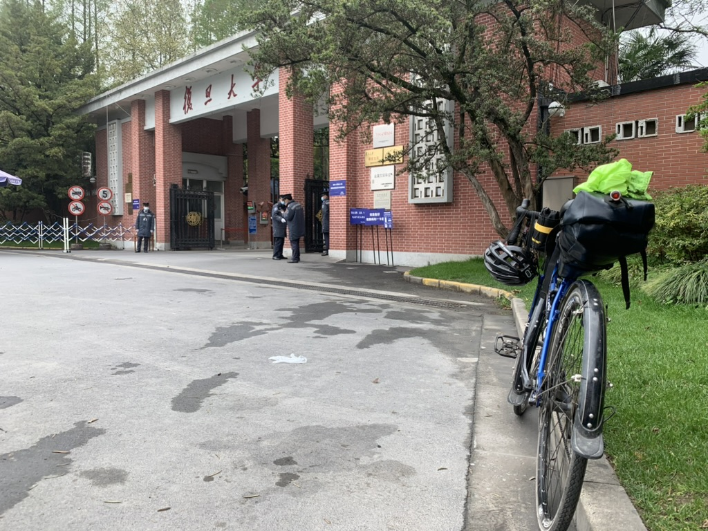

约的面包车本该十二点整就在邯郸路220号静候我，但却没有。从牌照可以看出，师傅来自福建南平。我试图从福建这个话题打开聊天内容，没想到师傅反客为主，开始打听起我此次旅行的规划。师傅是兼职跑货拉拉的，一般有空才跑跑单，所以我发现试图从他那里得知一些货拉拉的近况（如受长沙事件影响，货拉拉最近订单量是否明显减少）的努力是徒劳的。订单量在兼职师傅这里感知不明显，但有一件事是大概率受到长沙事件的影响的——师傅不厌其烦地向我这个老鸟说明变更路线的原因。

巴士在高速上驰骋了三个多小时。后来如我所料，我们终于在杭州出城方向堵起了车。司机显然也是老手，立即下高速走国道。于是，我见到了每次乘车时都让我身心愉悦的景象——旁边的高速堵爆，而我们在国道畅行。

临安在2017年撤县设区，成为杭州市面积最大的一个辖区。太阳下山的时候，我们抵达临安客运东站。从这里一路向西大约一百公里，就可以离开浙江去到安徽。临安西部与皖东南接壤，这一带多山。我此行的计划便是翻越海拔1300多米的临安太子尖，然后进入安徽境内，最后翻越“皖浙天路”抵达绩溪。

第一天就安排了夜骑。目的地是半个月前订好的位于昌化镇的民宿。昌化镇是浙西大峡谷的入口。据朋友介绍，他们此前是经由浙西大峡谷去到安徽，峡谷内风景也相当不错。但是，我这次更想去太子尖训练体力。后来的事实证明，太子尖并不是一个让人满意，甚至是可以让普通人绝望崩溃的选择。

在中国的东部地区夜骑是一件十分轻松愉悦的事情，因为你知道几公里、十几公里之后就会有一个镇子，而镇子上会有各种餐馆和超市等着你。就算你十分不幸地出了小事故，当地的出警速度也会让你大吃一惊。你唯一需要做的事情就是打开前后车灯，休闲地荡荡腿，然后思考待会儿夜宵到底是吃面条还是混沌。想到此前在新疆独库公路最后一天的遭遇，我和我的队友凌晨时分仍然在沙漠戈壁中前行，路上车辆稀疏，方圆几十公里没有人烟。伸手不见五指，唯有我们两盏微弱的车灯在黑暗里摸索。我们坐在路边休息，抬头就可看见满天繁星和深邃的夏季银河。那天骑了184公里，我们凌晨两点多进入县城，看见巨大明亮的月亮悬在这异乡的道路尽头。因为过于劳累，我下车的时候摔倒在地。对比之下，东部地区简直是人间天堂。

春天的夜里飘着小雨，昏黄的路灯照亮斑驳的小水洼，路边卖草莓的摊子十点钟还没有收摊。路上车辆不多，我这个赶路人在守摊的老爷子看来显得十分稀奇。在昌化镇上一家面馆，我停下休息了半个多小时。晚上没吃饭，要了一份牛肉拌面，开了个线上会议。老板说店里营业到凌晨两点，让我心头一惊。夜里十点二十分的时候，我抵达落脚点。房东已等我许久。

独行者往往不需要照顾、牵挂多余的队友，但同时他也需要能够很好地、独立地照顾自己。就拿早上出发这件事来说，独行者一般可以自由选择出发时间，而一支队伍则需要协调好每个人的情况。为了避免有人熬夜而第二天起不来床，我听说曾有领队睡前将所有人的手机没收。我第二天早晨七点多离开客栈，直接前往十几公里外的清凉峰镇吃早餐。我把这个看做今天行程的热身。若是一支队伍出行，不仅出发时间可能会推后，甚至整个行程节奏都会被拉慢。

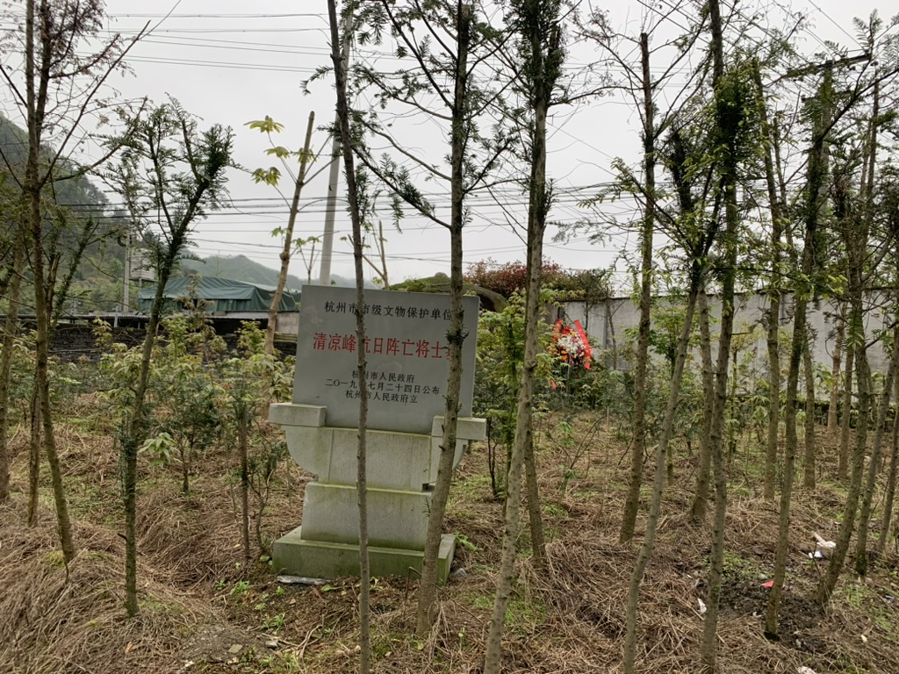

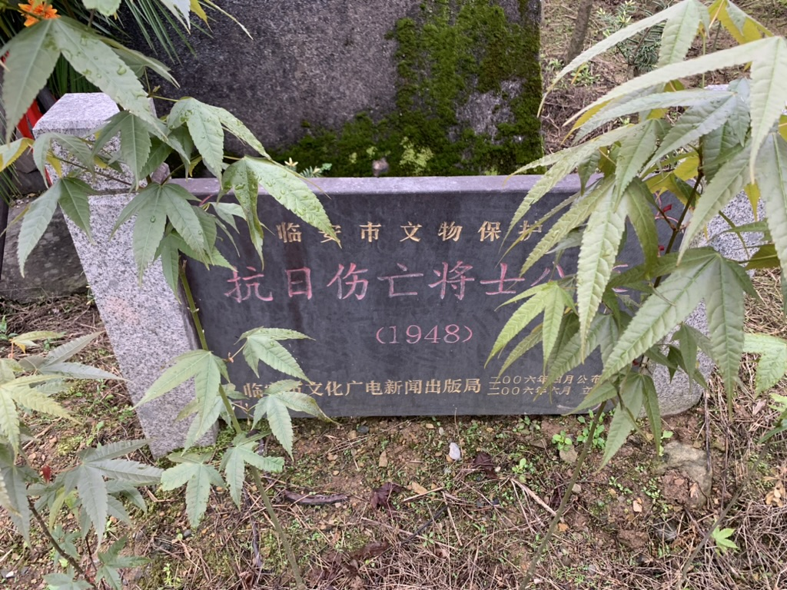

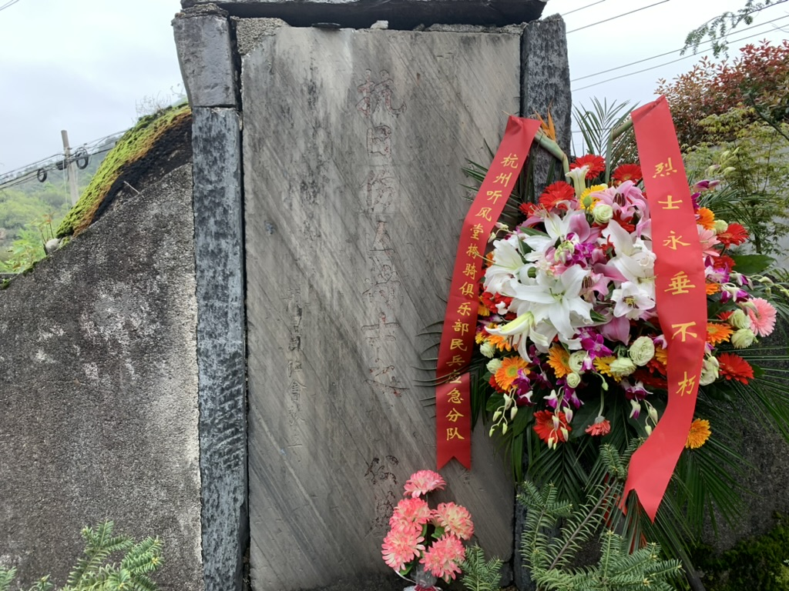

路上偶遇一个墓地，清凉峰抗日阵亡将士墓。边上有一个花圈，是杭州一个骑行俱乐部送上的。我钻进小树丛里，到无名英雄的碑前端正地鞠了三个躬。我想，这个墓虽然设在省道边，但是因为四轮汽车的速度太快，或许难以被来往司机注意到。而那个花圈表明，我们这种以一二十的时速在城乡大小道路上探险的人，更容易注意到那些不起眼的线索和细致入微的自然与人文景观。

这里可以延伸讲一讲我对不同旅行方式的看法。舒适度由高到低，依次是飞机、高铁、火车、汽车、摩托、自行车和徒步。所能见识到的细致优美的风景，若从高到低排序则恰好相反，所花费的费用由高到低也恰好相反。要想见识最极致的、最原生态的风光，徒步是独一无二的选择，但其对体力要求也是最大的，开销则堪称“吸毒”级别。飞机固然能够提供大气层俯瞰的视角，可是却无法贴近体察。又由于其只需舒适的几个小时就能完成从A到B的位移，相较于徒步动辄花费几个月风餐露宿才能由A到B，飞机的花费显然是最低的。

自行车在这个比较链中处于一个绝妙的地位。其花费不如徒步那么夸张，移动效率却远大于徒步。从体验的角度来看，中国的主流徒步者喜欢在山林间或山脊上穿越，往往丧失了接触中国乡村的机会。就算他们偶尔会在某个村子的小卖部歇脚，也只是为了寻得补给转而继续进山。自行车旅行者则不然。自行车允许异文化探险者在除高速公路以外的任何道路上前行。在中国这样一个道路铺设十分完备的国度，自行车能够去到任何一个乡镇和村落。而乡镇和村落恰恰是乡土中国最真实的一面。这里有人，有集市，有风俗人情，有各种生命景象，有除了摩天大楼以外其它该有的一切事物。

汽车是一种我不怎么看得起的旅行方式。虽然过几年我可能就会变成汽车旅行者，但是我现在仍想对汽车做一番批判。很显然，汽车是一种只允许探险者躲在铁皮箱子的旅行工具。人类有那么多种感官，可是汽车只允许乘客使用视觉这一种感觉去认识外面的世界。大自然最宝贵的馈赠——风雨雾雪都被阻隔在外。躺在床上看手机里的那些美丽风景图，和开车出去有很大差异吗？

麦克卢汉说：“以旅行为例，旅行的过程与其说是在欣赏新的环境，不如说是在寻找已经在媒介里获得的想象，用实物来验证自己想象中的符号。于是，世界本身成为一个博物馆，馆中的藏品是在别的媒介里曾经见过的。”从多感官的角度讲，我认为麦克卢汉这段话里所讲的“旅行”应该限定为“汽车旅行”——至少不能包括“自行车旅行”。因为现代技术的媒介所能给我们提供的想象仅限于视觉和听觉，而汽车旅行恰好能、也只能满足这两项感官。由此，我们又可以提出上一段的问题：躺在床上看手机里的那些美丽风景图，和开车出去有很大差异吗？

某些时候，我的脑海里甚至会冒出一个极端的想法：最极致的感受自然的方式应该是光脚徒步在野地上，就像野兽那样。带有轮子的交通工具都在水泥或柏油上面移动，借此提高位移效率和舒适度。可是别忘了，正是这水泥和柏油填平了大自然最鬼斧神工的坑坑洼洼和岩石绿草，正是这水泥和柏油阻隔了探险者与大自然的亲密接触。这水泥和柏油甚至比汽车的铁笼子更加罪恶——因为我们几乎时刻置身其上，它让我们不再留恋、乃至忘记了最朴素的泥土。在这里，水泥和柏油就是让我们停留在舒适区的现代化媒介。

继续说我在清凉峰镇吃早餐。早餐是一个兰州小哥给下的兰州拉面。清凉峰镇是浙江山区典型的小镇子，位于清凉峰国家级自然保护区的南边山脚下。镇子坐落在峡谷之中，一条小溪穿市而过，几座路桥搭在上面。最后喝掉几口面汤，我向小哥告别，启程向山里进发。

还没走出多少，就遇见路边一个巨大的告示牌，上面赫然写着“华浪线塌方 禁止通行”。我心头大惊，到附近村里小卖部询问无果，又到村委会问路。村委会干部很热心，却提供不了前方路况，于是建议我到山脚下的浪广村问问。作为老鸟，我立马有了主意，在携程上找到位于浪广村的一家客栈，一个电话拨了过去。客栈老板终于接了电话，告诉我可以通行，翻太子尖也没问题。我心中石头落地，否则我就得走回头路了。这使我想起三年前在香格里拉翻山越岭的时候，没地方住宿，我们就找到村子里的派出所。民警十分好心，把我们安排睡在卫生院。那一晚，卫生院里唯二的两张病床终于迎来了睡客。对了，白色的被子是微微发霉的。我突然想起列维-斯特劳斯说的：旅行途中种种意外事件常会带来此类意义多样的景象。

从清凉峰镇出来十公里不到，路况就可见的差。路边的施工牌告诉我，前面还有五六十公里都在修路，路面全部被打烂。恰好赶上清明时节雨纷纷，路面十分泥泞。这种情况如果是新手早就投降了，可惜我此前有过不少穿越烂路的经验，再加上浪广村客栈老板的说法，我决定赌一把，一条路走到黑。路再烂，无非就是扛车徒步罢了。

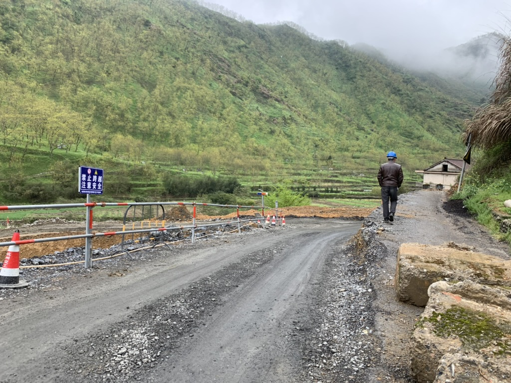

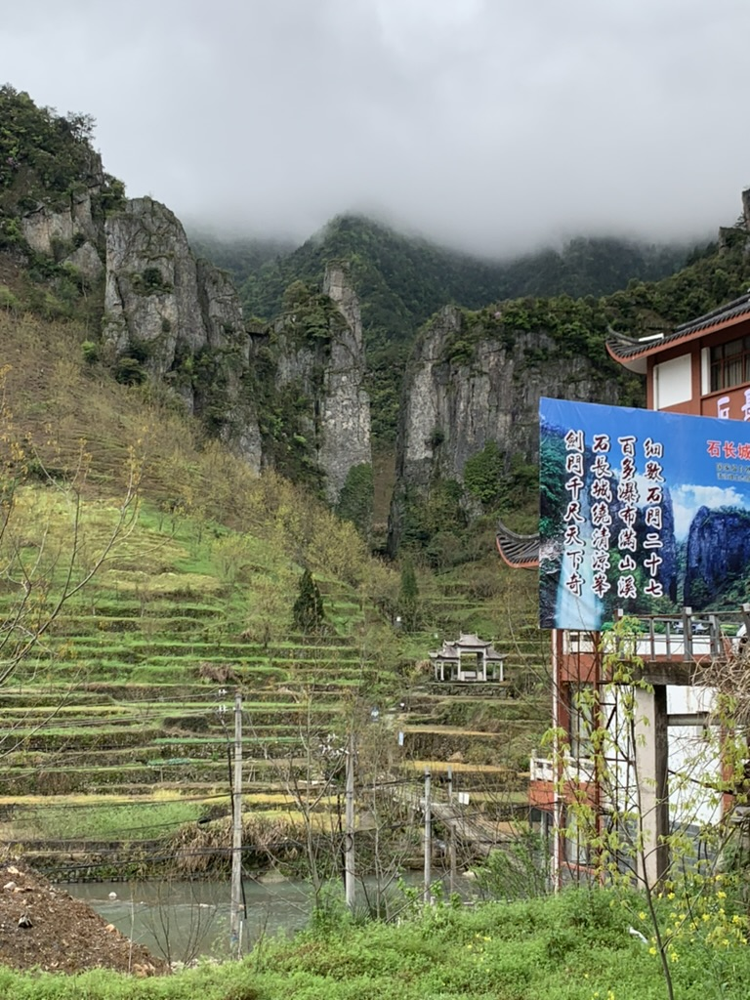

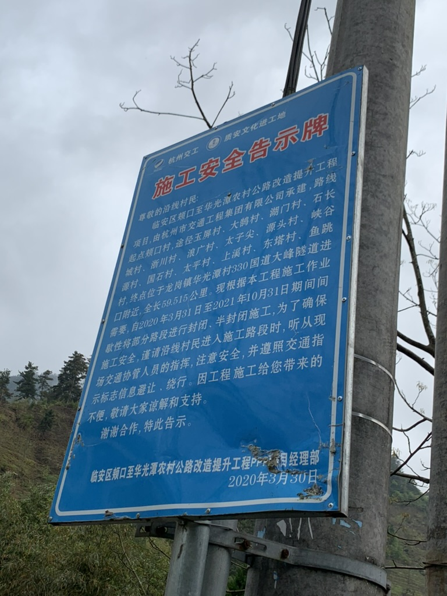

自浪广村上山以后，就不断有人告诉我前面路不通，走不了。但同时又有一位大哥告诉我，自行车推车是可以过的。我说，“那就没问题”。心想，我是推车上过大雪山的人，那次我可是推了二十多公里呢。

一路上见到最多的人就是修路工人。他们有的站在雾气弥漫的悬崖边上聊天，有的躺在转个身就能一落千丈的路牙上午睡，还有的操作着大型施工机械忙忙碌碌。修路工人这个身份往往让我想起独库公路。独库公路上世纪六七十年代修成，牺牲了一百多名战士。每几公里就是用一个年轻战士的生命换来。现代工程技术的发展让我们能够修建川藏铁路，能够轻松养护任何一条公路。这些修路工人和养路工人保护着中国经济的大小血管。他们伟大，却也渺小。我在云南和四川交界的地方也见到许多修路工人。他们朝我大喊“扎西德勒”。他们和我一起在崖壁下躲雨。他们问我要不要一起吃饭。他们之中有心善的人开面包车把我们拉上垭口。

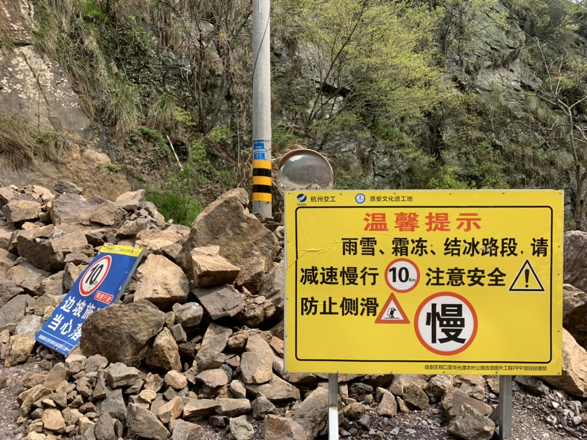

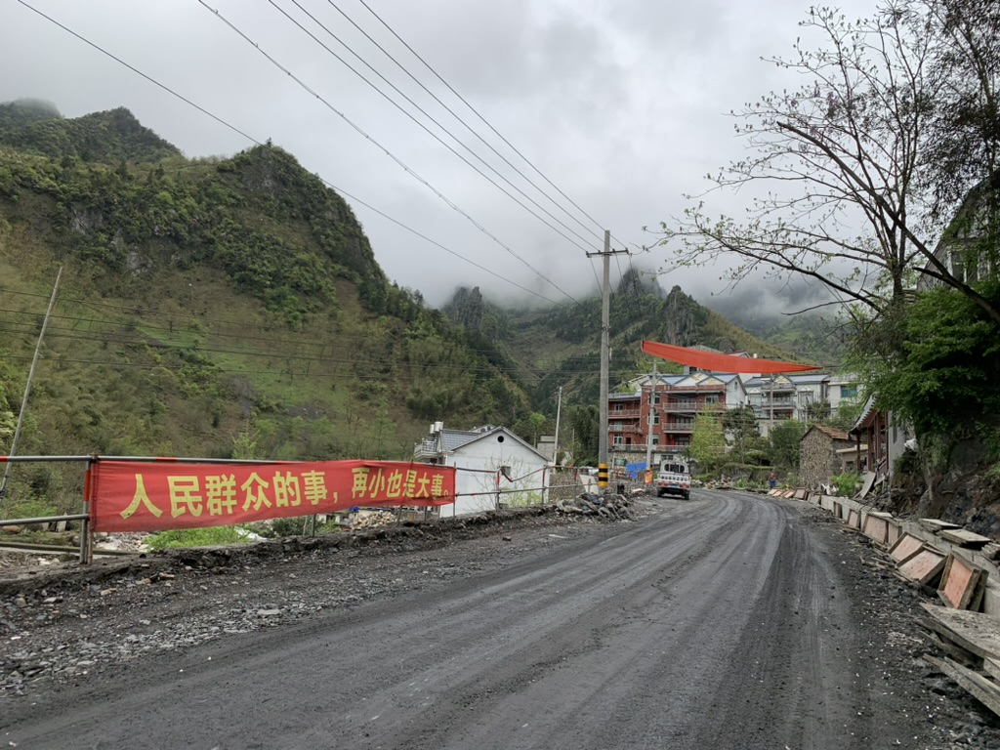

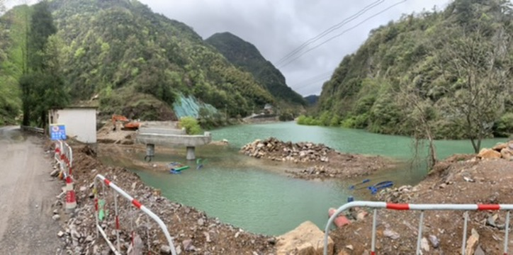

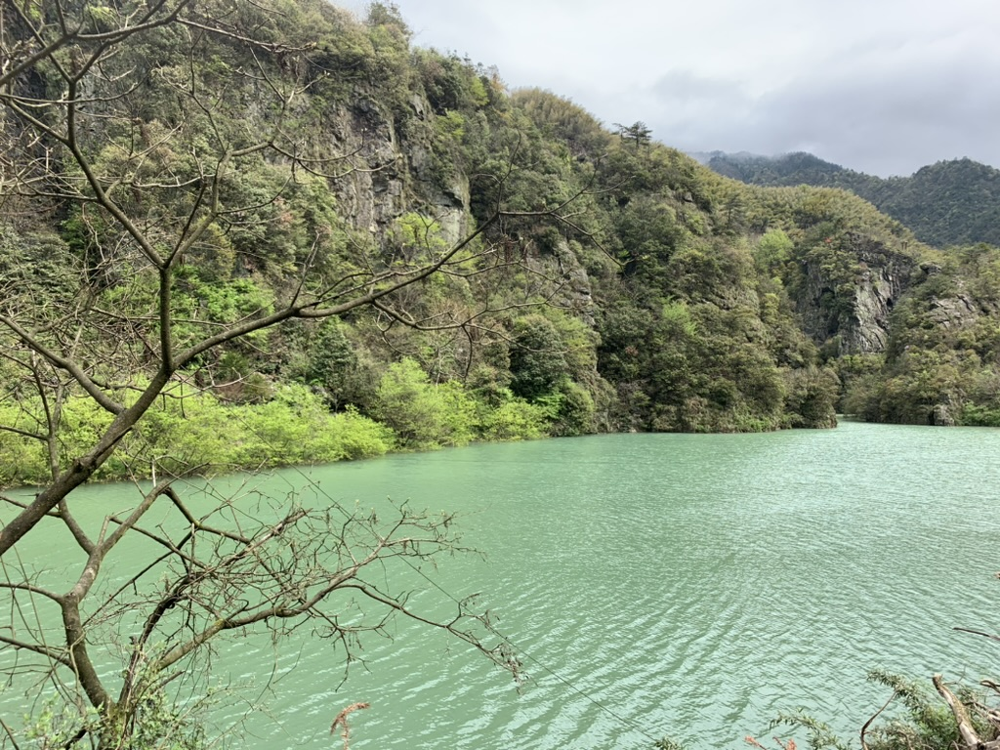

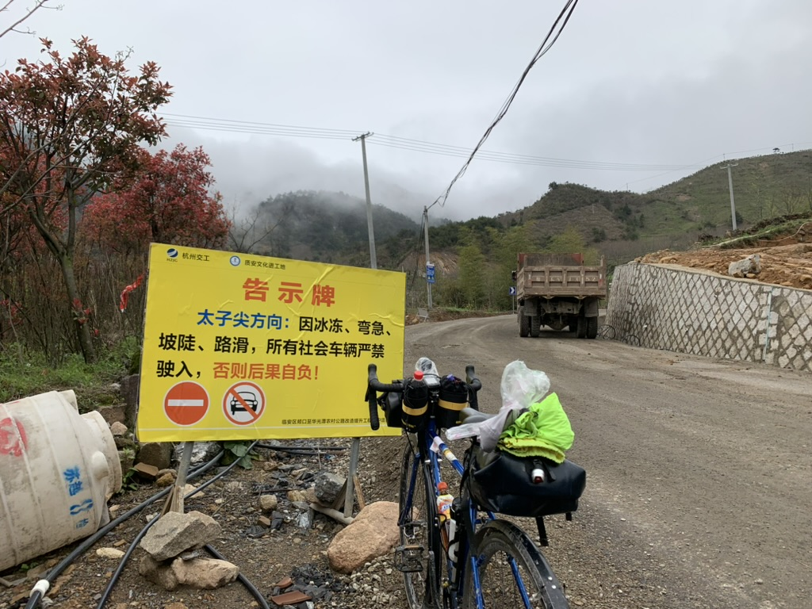

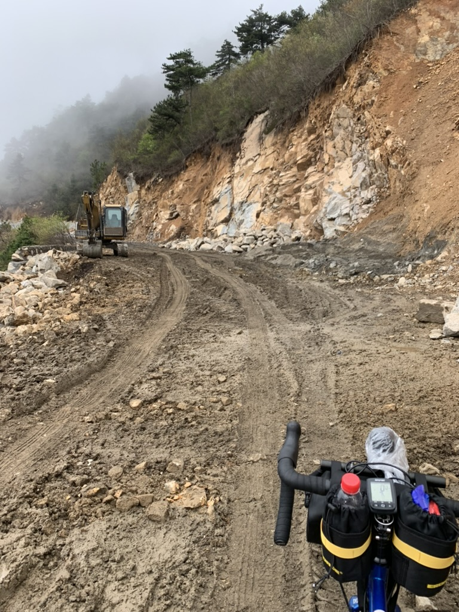

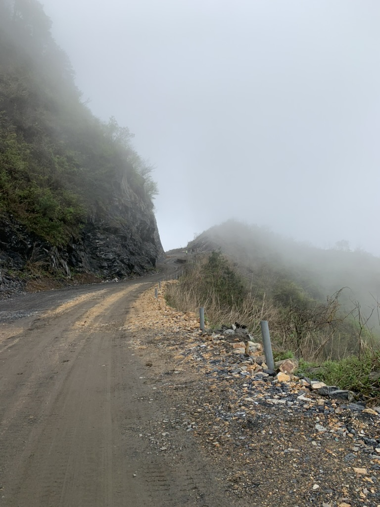

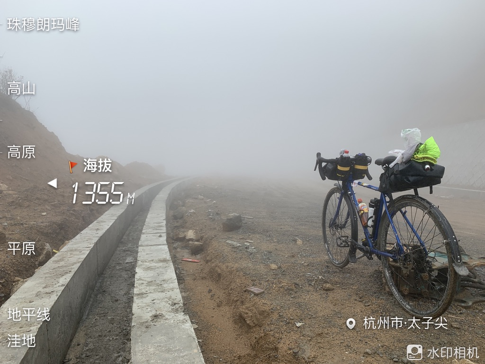

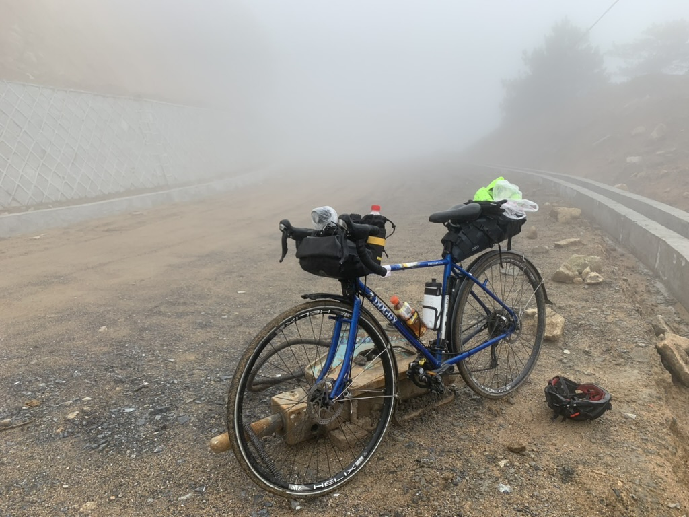

太子尖公路垭口海拔1355米。我到的时候能见度不足10米，人在云里雾里。本来是站得高看得远，现在是什么都看不见。我换好衣服后立即下山，期待着下山的路况能稍好一些——至少不会让自行车滑停。事实给了我沉重的打击。上山的时候是南面山坡，下山变成了北面山坡。北坡水汽雾气更重，能见度更低，路面更加泥泞湿滑。大自然给我这个幼稚的人类上了生动的一课。我的眼镜镜片变得十分模糊，全指手套也被水汽浸湿。自行车前后滑停数次，要么是轮胎深陷泥潭，要么是泥瓦被完全堵住。心态崩溃的我甚至快要下手把泥瓦给拆掉了。

下山途中也遇上不少修路工人。为了表现优雅，我选择压制对泥路的愤怒，淡定地推车从工人身边经过。有一辆挖掘机完全占据了路面，没有给哪怕一辆自行车留下通行空间。师傅注意到我的接近，他很礼貌的转动车身，让出一个空间给我，并且还用挖斗给我压实了路面。我向他大声道谢。出门在外，我们是默契的陌生朋友。

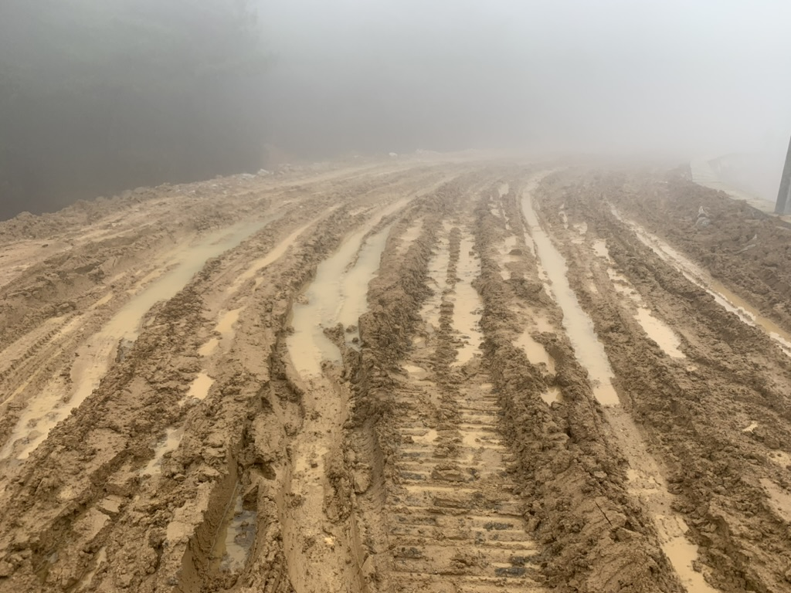

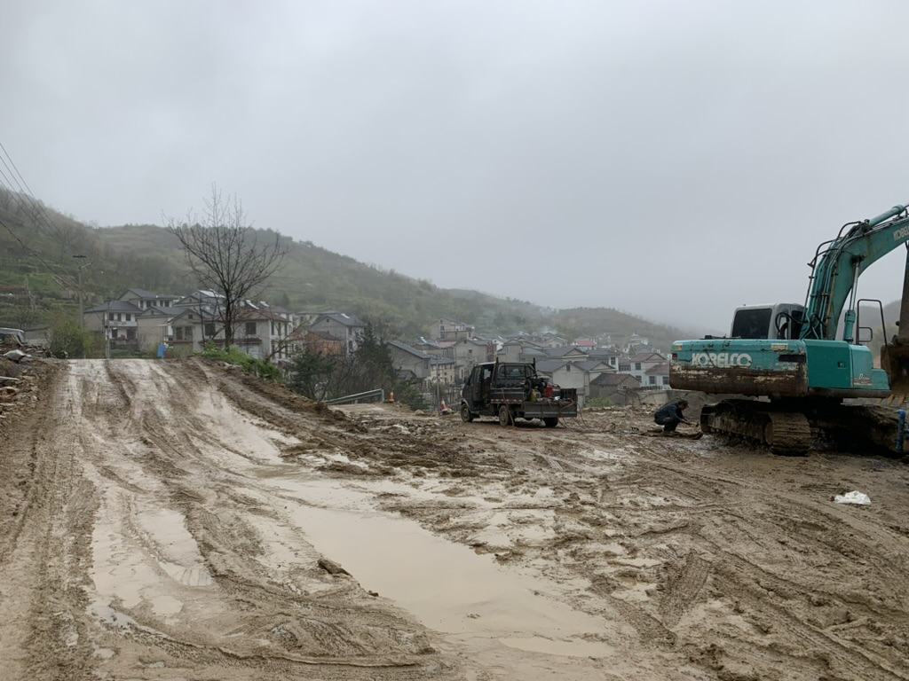

下山后，我穿过许多个村子，路过许多村民家门口。这种感觉是奇妙的，就像年轻的人类学家第一次踏足某个原始部族时，村民们向你投来好奇的眼神。与人类学家携带照相机不同的是，我们戴着一种特殊的帽子，骑着一辆车把弯曲的自行车。不速之客突然闯入了他们的村子，狗子不叫，村民的眼神却会说话。我想起来在浙江南部山区的时候，我们三辆车前后一列，速度很快，靠的也很近。一个没留神，三辆车在村道上先后从同一只鸭子身上压了过去。可怜的鸭子只是借道水泥路，从这边的水田跑到那边的水田去。我们立马停在路边，发现鸭子几乎瘫痪了。我问边上路过的阿姨该怎么赔偿。她或许是看到我们几位不速之客，并且这几位不速之客还干出了这种事，她露出了十分惊诧的眼神，一瞬间没有反应过来似的，直直地说“你们走吧，没事的”。原来，人最本能的反应是友善的、是相互理解的？

傍晚的时候，我经过皖浙地界，路过一个叫做下胡家村的地方。村口有一个宣传栏，里面有一份2019年的通知，标题是“中共绩溪县委关于在全县党员干部中开展向李夏同志学习的决定”。我了解到，在山洪爆发时，李夏同志在转移群众过程中突遇山体塌方，英勇牺牲。他牺牲的地方就在这下胡家村。我望向不远处连绵的山峰和路边潺潺的小溪，想象彼时的场景，顿时生出敬畏之情。他是我的前辈，是一位全心全意为人民服务的模范党员前辈！

第二天晚上睡在小溪边上的荆州乡。这是一个非常偏远的乡镇，离绩溪县城八十公里路，每天只有三班客运班车往返县城与这里，途中还要翻越最高海拔一千两百米的皖浙天路。我是第三天出发的时候在车站边上一家超市买水，顺便问到了班车的时刻表，分别是早上六点、七点和下午一点，两边对开。超市是一个老头子在卖货，我和他交谈的时候他正在编织类似于纸花一样的清明用品。这一天是清明节。

荆州乡在我看来是一个民风淳朴的地方。或许是因为位置过于偏僻，这里的人们很大程度上还没有遭受现代文明某些糟粕的毒害。晚上住在一个农家乐，吃饭也在他家。我看菜单上有一道笋尖烧肉，虽然48块钱有点小贵，但我还是立马就要了。一路上看见很多村民家里都在剥笋、烧笋，嘴馋的我也想要尝一尝本地最原生态的食物。呈上桌一看，量挺大，笋嫩而脆。我一口气两碗饭下肚。结账时，老板娘说“你付35就行了”。我顿时想向她敬礼。

听老板和其他房客的聊天，我大致总结出如下信息：老板30岁左右，在宁波有房有车，教高中数学。这次清明假期和老婆一起回家住几天。平时，农家乐由老板的父母经营。

皖浙天路在华东地区的骑行圈是一个小有名气的挑战，其垭口离荆州乡只有十五公里不到。老板说经常会接待一些骑自行车过来的房客。有一次国庆假期，下雨气温低，一个老爷子深夜才赶到农家乐。老人家从车上取驮包的时候手臂发抖没有力气。于是老板帮忙取了下来，还倒了一杯酒给他暖身子。

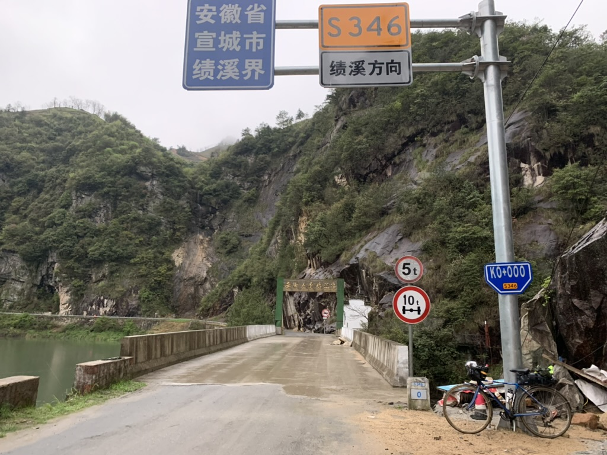

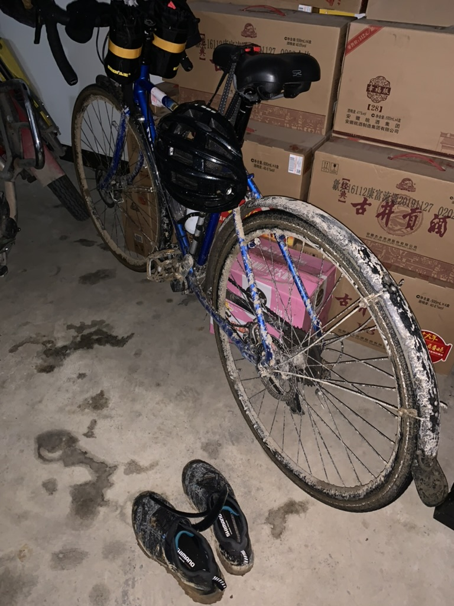

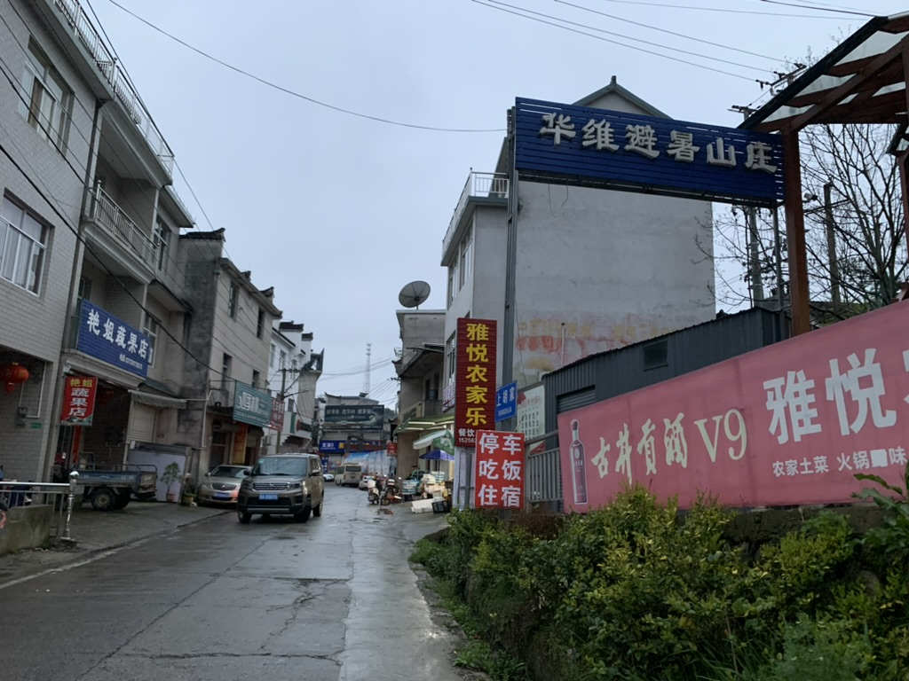

第三天早上吃了碗味道很好的“荆州”汤面，下了两个茶叶蛋。上午九点左右就抵达了皖浙天路垭口处。海拔1141米，温度5摄氏度。自从昨天傍晚进入安徽境内之后，路况就好了很多。皖浙天路上更是完美无瑕的柏油路面，我的心情也跟这路面一样舒畅。唯一恼人的是这不肯退去的大雾——和太子尖一样，这边也是雾气蒙蒙，能见度极低。下山的时候，我留心了路边的公里桩，发现我是从第18公里桩处开始下山，一直到25.7公里桩处我都是在大雾里。有那么一个瞬间，我有一种很梦幻的感觉：我的速度很快，前方的路面突然消失了，我就好像在云里遨游，突然失重。

在大雾或云层里下山是十分梦幻，也是十分煎熬的。我推荐你有机会一定要试试。我只能看见前面十米的路况和白色标示线，由此去预估前面更远处的、尚处在能见度之外的路况。我必须基于这种并非100%可靠的预估去实施减速和转向操作。手套自然而然地湿透，十根手指好像被浸在冰水里一般。我想起以前在天山下山的时候，连续下坡7公里都在云层里（海拔三千多米）。出云层的时候，我们的手指早已麻木僵硬，万幸的是找到一个路边的烧烤摊取暖。

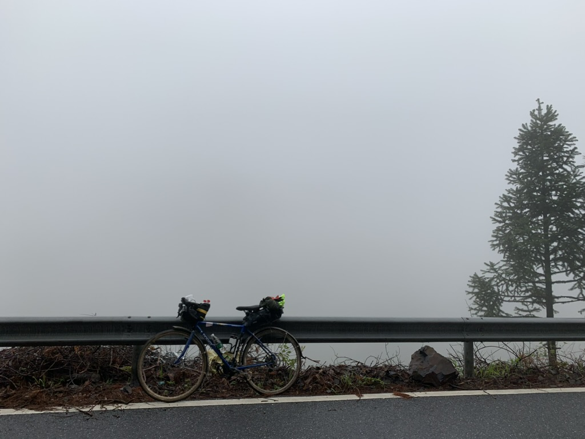

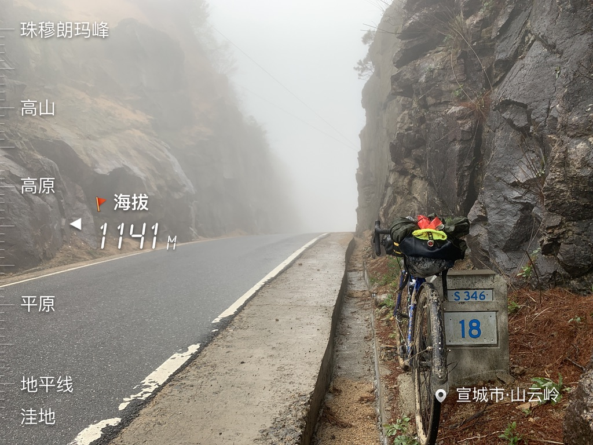

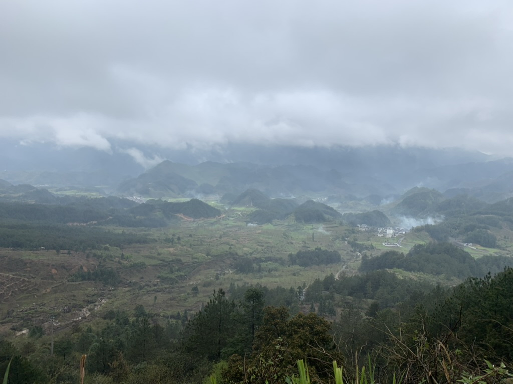

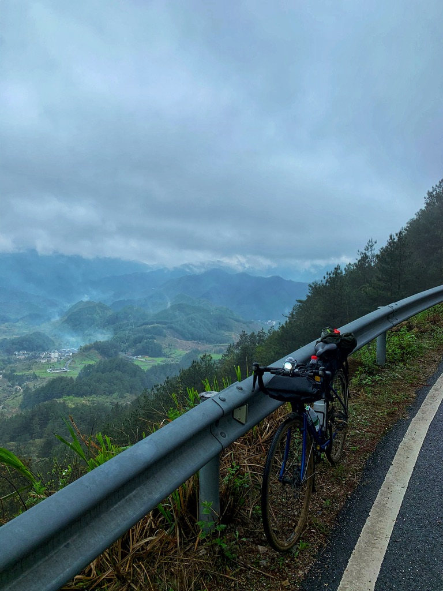

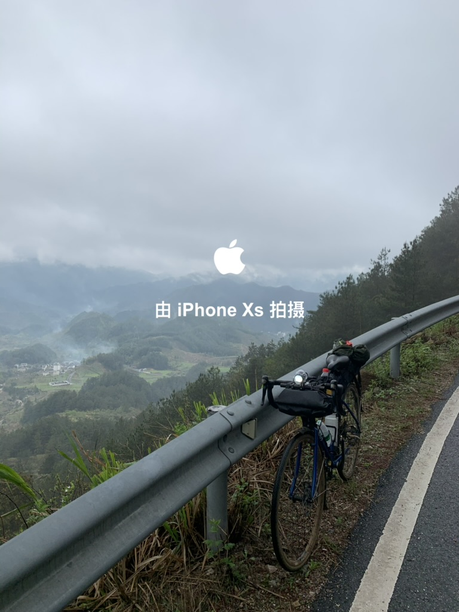

在第26公里桩附近有一个发卡弯。这里是半山腰，有一个观景台，能够看到山下家朋乡散落的村庄，白色的徽派民居坐落在绿色的油菜田里十分亮眼。田间地头和山林里时不时有爆竹声传来，半空中升腾起一阵一阵的白色烟雾。后来我走近了才发现，这是安徽人民在扫墓的时候行的放炮礼仪。

从荆州乡这边翻过皖浙天路就来到了家朋乡。家朋是取自许家朋的名字。许家朋是安徽省绩溪县家朋乡坎头村人，是中国人民志愿军涌现出的又一个黄继光式的英雄人物。他在朝鲜铁原以西石砚洞北山反击美军第七师的战斗中，用胸膛堵住正在射击的枪口，以自己的生命为部队开辟了进攻道路。后来，英雄被所在部队党委追认为中国共产党党员。

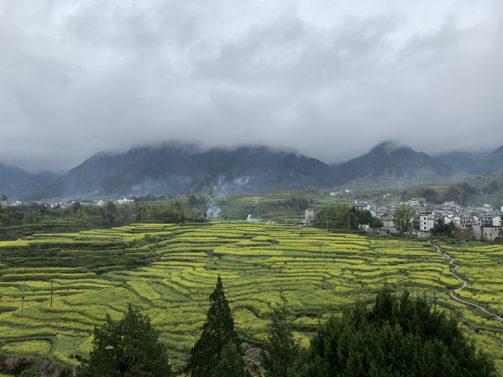

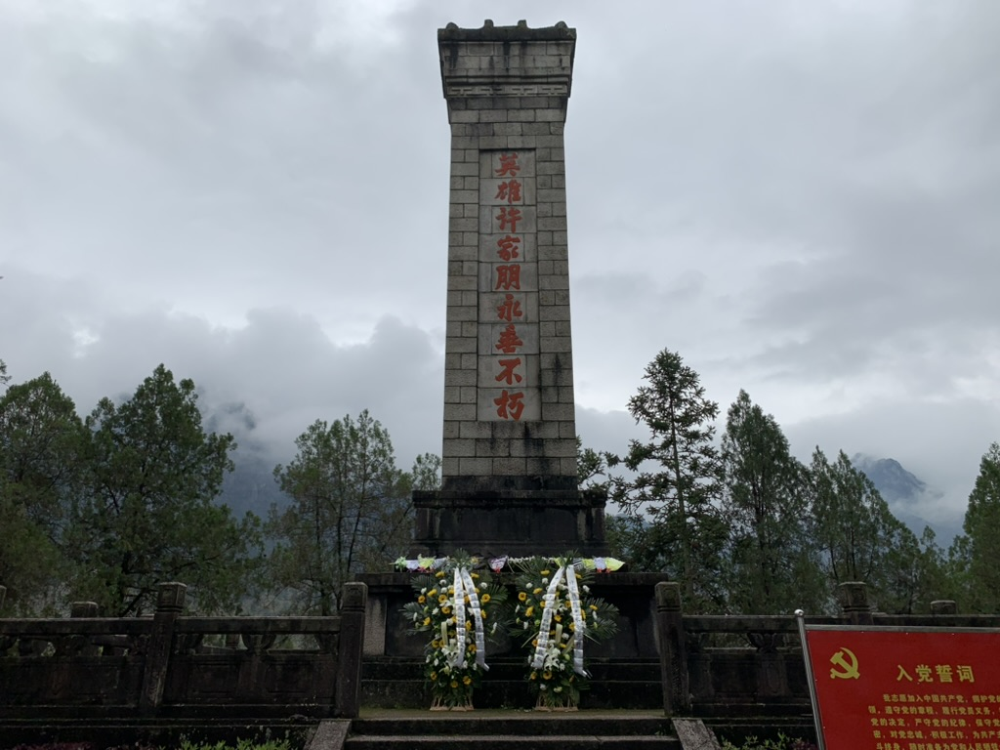

恰好这天是清明节，我蹬起自行车来到英雄的纪念碑缅怀。纪念碑修在一个小山丘顶上，显得颇为肃穆，有人在此缅怀。附近山林里，家朋人民都已归乡，扛起锄头、提着纸钱、点燃烟花，以最朴素传统的方式祭奠祖先。纪念碑前有一面写有入党誓词的党旗，放炮声中，我默默在心里重温了一遍誓词。

说回家朋人民放的烟花和鞭炮。我仔细观察发现，多数是那种拿在手里点着的冲天炮，但是却没有普通冲天炮发射时的那种嗖嗖声；少数放的是小筒状的9或16发的烟花。冲天炮发射的时候会响一下，在最高点的时候又会爆响一下，然后散出白色的烟雾，碎纸屑则掉落在地上、马路上和我身上。我骑车摇摇晃晃地路过放炮现场的时候十分忐忑，因为这个炮并不是欢迎我这个不速之客的仪式。并且我十分害怕某个劣质的冲天炮掉到我身上的时候才爆炸，那样可就好玩了。

对于我这个异文化背景的人，这种放烟花的仪式引起了我的好奇。在我家扫墓的时候都是放鞭炮，不管红白喜事也都是放鞭炮，只有在逢年过节这种喜庆的氛围才会放烟花。可是这边的人们在清明扫墓的时候白天也朝天上放烟花，这是为什么？我并没有机会对此做进一步田野访谈，只能给出我的猜测：或许烟花并不只是意味着喜庆；或许放烟花是告诉已逝的亲人我来上坟了……留待日后检证。

第三天的行程十分顺利，我不太费力地爬上了垭口接受大雾的洗礼，然后一路溜坡到家朋乡瞻仰烈士纪念碑，好奇于人们的清明节放炮仪式，遇见了披着蓑衣戴着斗笠的农人，最后前往有“东南邹鲁”之称的绩溪（县城）。这是从山野重返现代的一天。逐渐变得宽阔的道路，单独的自行车道和横亘在古徽州大地原野中的高铁大桥，都提醒着我此次行程即将结束。

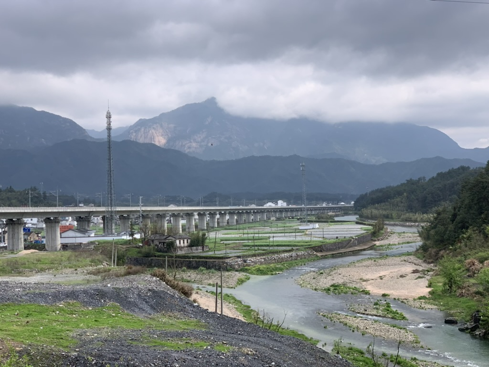

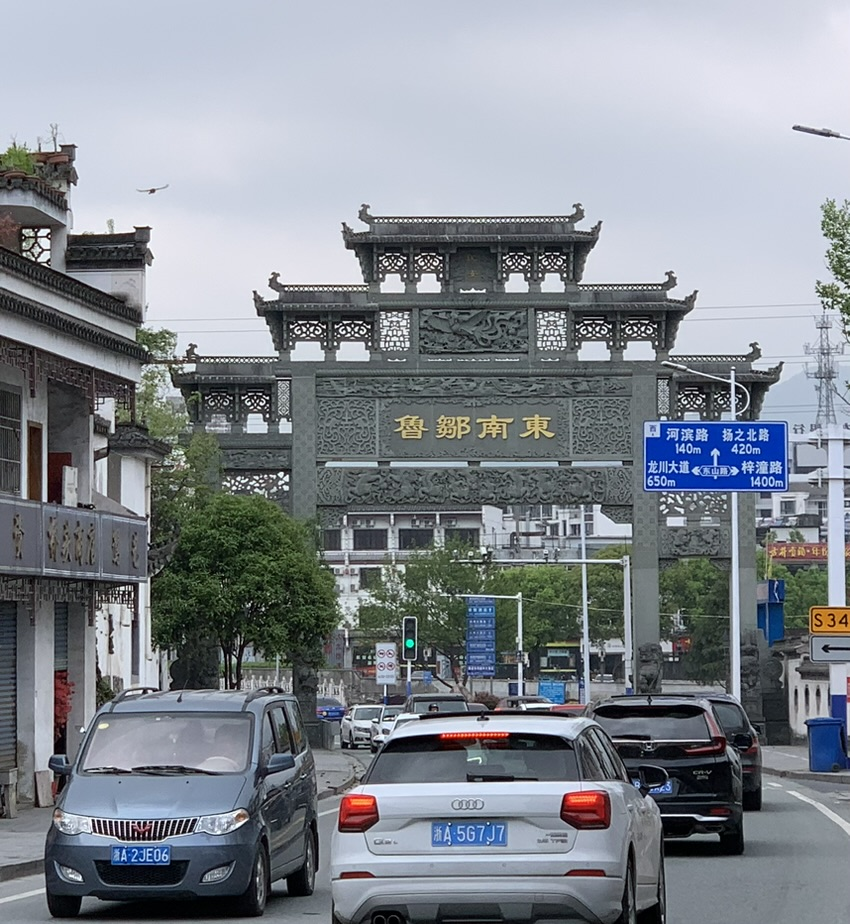

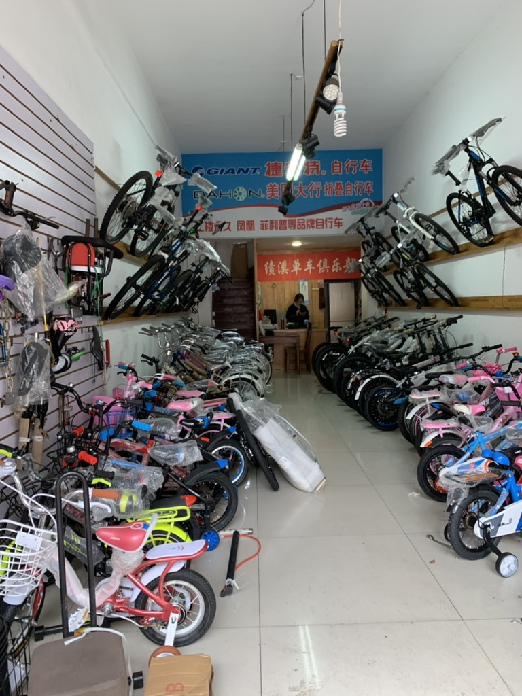

借助自行车这样一个媒介，人力被发挥到极致，我能够在两天半的时间里走完230公里，逾越两座大山，让被现代工业秩序压抑已久的心灵出来透透气。读万卷书，行万里路。万卷书目前还没有达成，万里路却是真真实实用车轮滚出来了。像早期欧洲旅行家那样出去探险，然后回来做一番激动人心的报告，这不是我所期待的。行走好像越来越不能成为我的谈资，它只是积淀为一种结晶，化为一种沉默无言的经验。