# 2022-01《骑行中越沿边公路（上）：一个人的宿营旅行，遭遇了疫情管控和连日大雾》

219国道全程一万余公里，是中国所有国道中最长一条，连接了许多不同的地形、海拔、气候与人文。因起止点分别是新疆喀纳斯和广西东兴，又称喀东线。这是一条每一位公路旅行者都想要用足迹丈量的景观大道。

从新疆叶城到西藏拉萨，这段219被称为新藏线，全程海拔四千米以上，包括多个高山达坂。离开拉萨，219延伸到云南境内，再从富宁离开云南进入广西。自歪邓桥进入广西境内后，一直到海滨城市东兴，219是广西政府重点打造的“边海风景道”，民间又称为沿边公路。

2022年1月，我从上海飞到昆明，先后通过骑行、大巴、中巴来到云南文山洲新街镇，在这里第一次站上219国道，并一路沿着中越边境，试图以一人一车最终抵达广西东兴。在此之前，我虽然到过中国许多省份，却还未曾踏足过中国的任何边境地区——无论是陆地还是海上。边境的迷人之处在于两种文化的碰撞和交流，在于明明很近，却被一条线分隔得太远。

每一个边境地区都有自己的故事，北部新疆见证了新中国与苏俄的博弈，南海是中国与某些国家的斗争场。而中越边境自上世纪70年代末开始，经历了一段不太平的战争岁月。时至今日，中越关系仍旧微妙，远不如中美、中俄关系那般明朗。

1月4日下午，我叫了一辆货拉拉，把自己和自行车拉到浦东T1出发层。自行车事先用纸箱打包好，在航空公司柜台说明情况后有工作人员带路去超规行李托运处办理手续。在东航托运自行车，只要不超重即可，三边尺寸无严格限制。而30kg免费行李额我用了26不到。这是我第一次坐飞机时携带自行车，十分顺利。此前我在公众号分享过飞机托运自行车的基本操作，感兴趣可以查看。另外，友人最近还告诉我：买个装车袋即可将自行车带上高铁。看来建设体育强国、全民健身事业正在稳步推进。

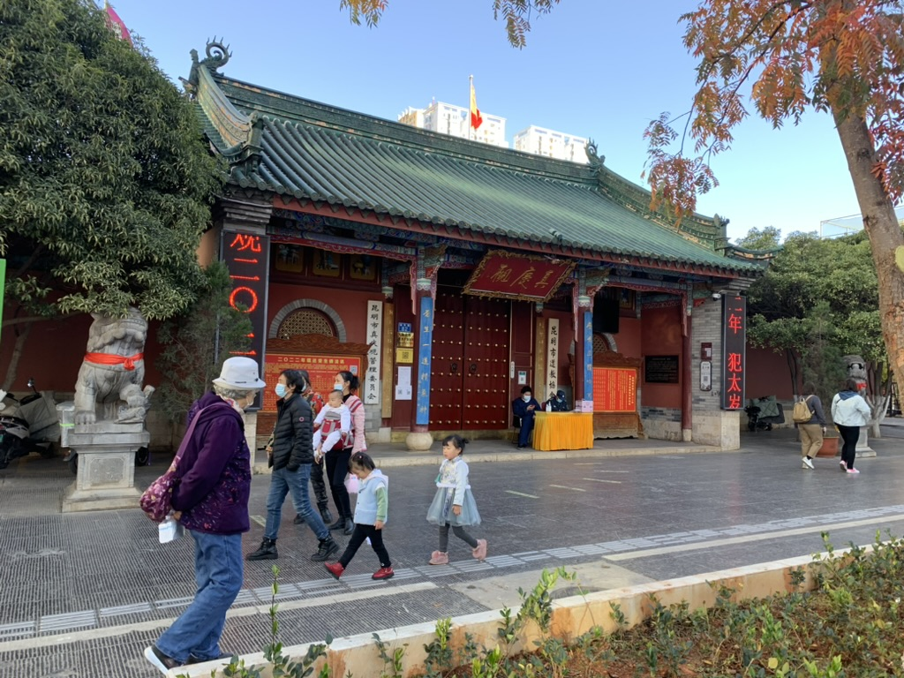

昆明春城名不虚传。第二日晴空万里，路边花花绿绿。码表记录的最高温度居然达到26度。

5日上午在昆明市区取了气罐（做饭用），然后沿着滇池环湖路去到澄江市。在加油站吃午饭，一位大叔向我打招呼，问我去哪。抚仙湖，我说，然后去广西。

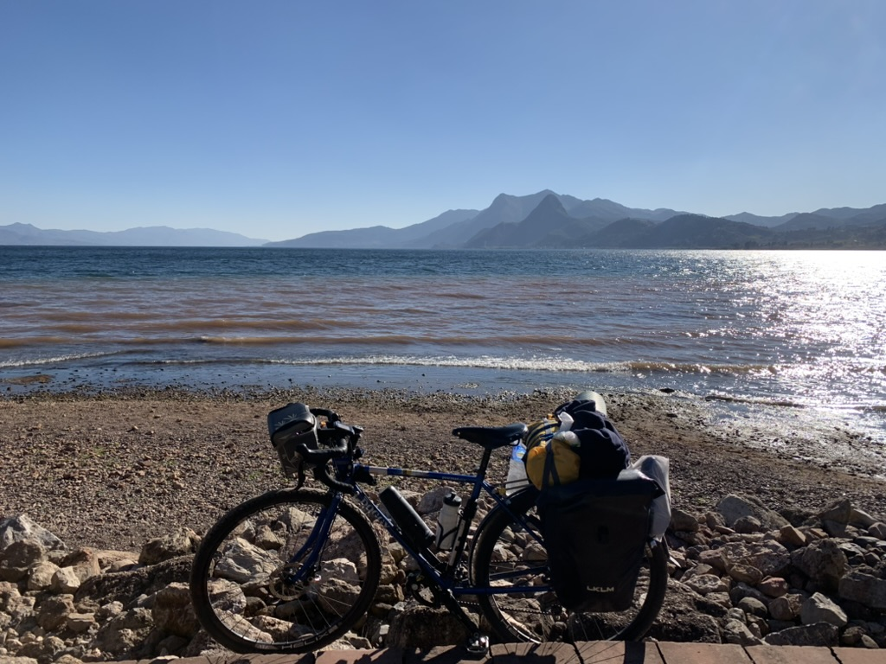

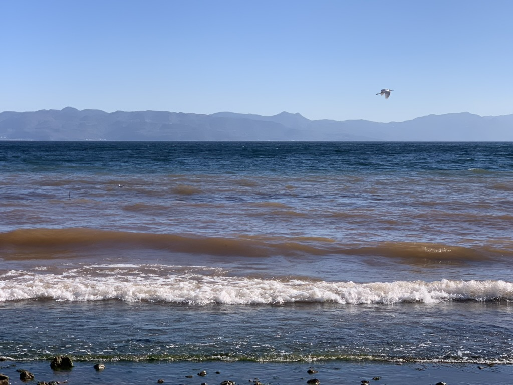

抚仙湖。近处由于冲刷红土壤而变色。

多数时候，自然风光必须天公作美时才最宜人。抚仙湖三面倚着山丘，湖光山色，在蓝天阳光的映衬下，荡漾的湖水拍打着北岸的城市。古时，附近滇人除了农业狩猎外，还在湖中捕鱼。附近出土的文物中就有许多与渔业有关的工具。在李家山青铜器博物馆，我看到古人也在青铜器、陶器上绘制与鱼相关的图案，好似图腾与崇拜。

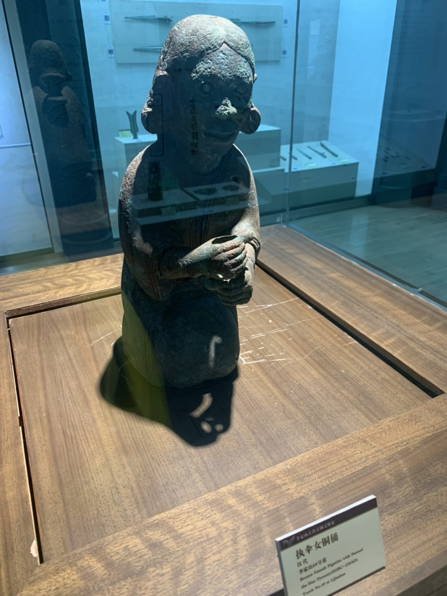

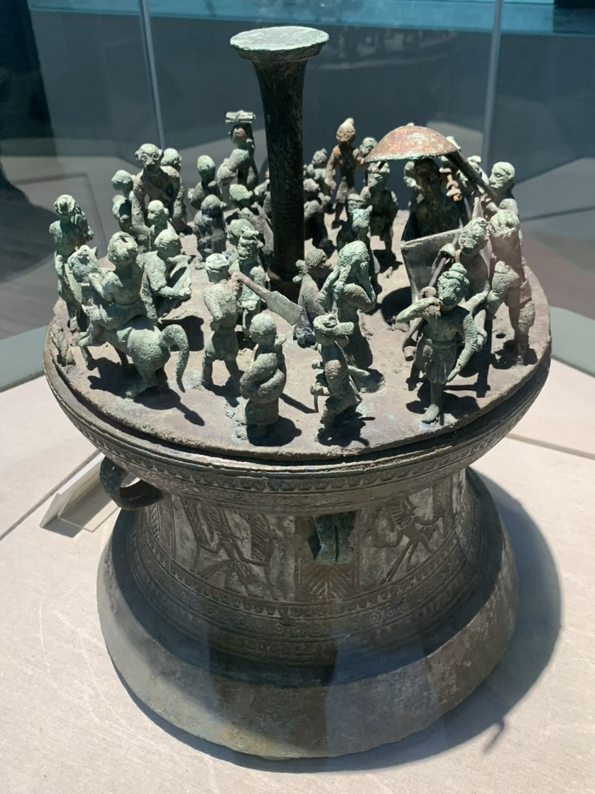

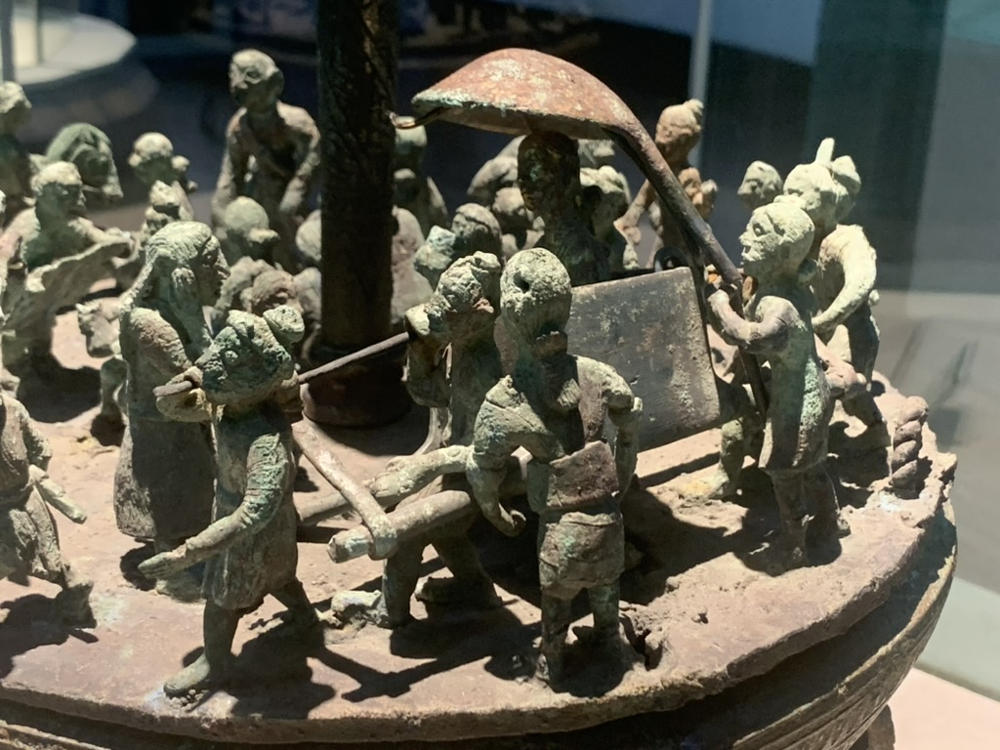

展品，来自李家山青铜博物馆。

当地人说，抚仙湖沿岸原来有很多饭店，现在饭店都已搬走，改为湿地与公园。傍晚，我来到西岸一处村庄，却发现已经拆迁，一排游船搁浅在沙滩上。在一家饭店买了挂面后，我来到一处湖边树林搭营。

记得2017、18年去洱海时，也见到以保护生态、涵养湿地为目的的对湖滨饭店的关停与搬迁。现在，昆明开始举办生物多样性大会，全世界的目光聚焦于此。云南有哀牢山、高黎贡山、横断山脉，也有红河、金沙江、滇池、抚仙湖、洱海、泸沽湖等诸多河川湖泊，丰富的地形地貌和独特的气候特征造就了这里极度丰富的物种资源。通过承办生物多样性大会，云南展示了它走在人与自然生命共同体的道路上的坚定步伐。

吃过晚饭后，我钻进睡袋。这是我第一次独自进行露营式骑行，外面有湖水哗哗声，鸭子在游水，南风在吹动树梢，好像有人在走动。

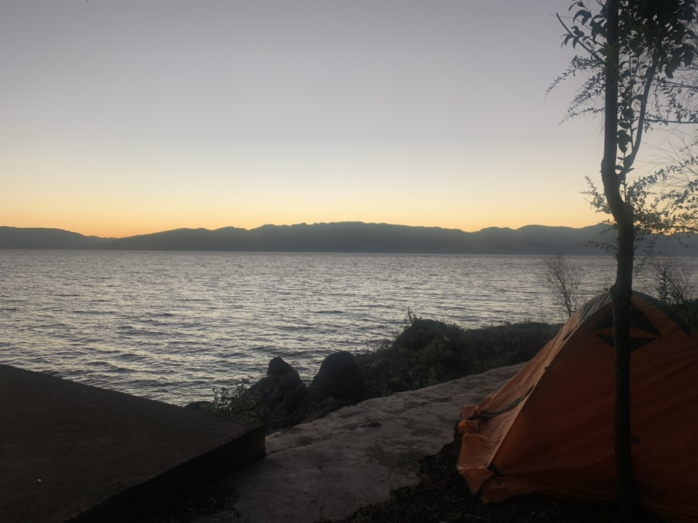

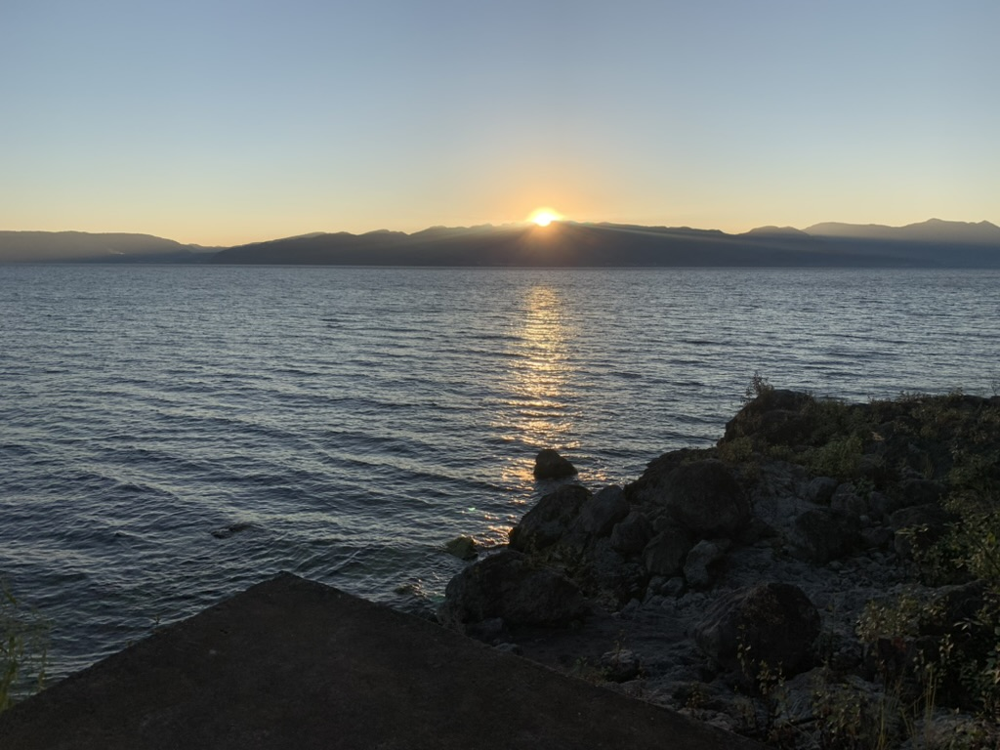

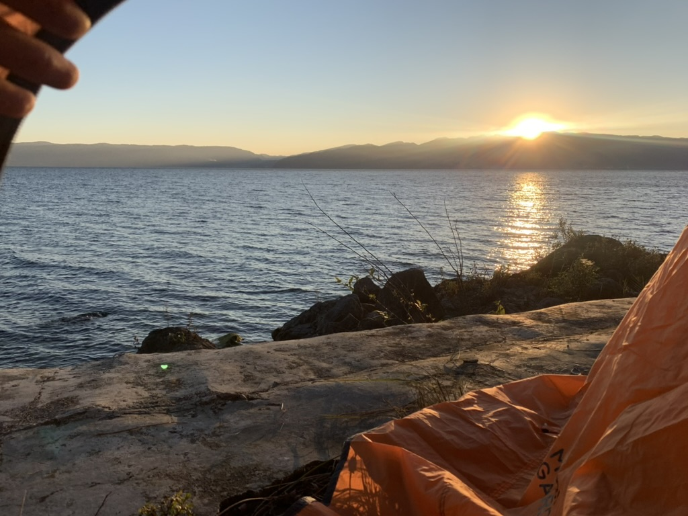

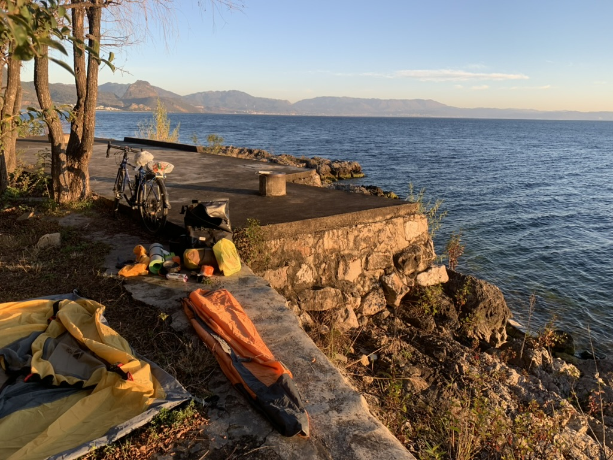

清晨太阳升起，阳光逐渐洒下。

6日清晨，醒来后首先出帐篷检查一圈，自行车还在，太阳照常升起。洗漱与早餐是在最近的加油站完成的。这里距离首府昆明仅几十公里，物资补给当然不成问题。但我估计，再过两天去到边境后，物资条件将变得艰苦。

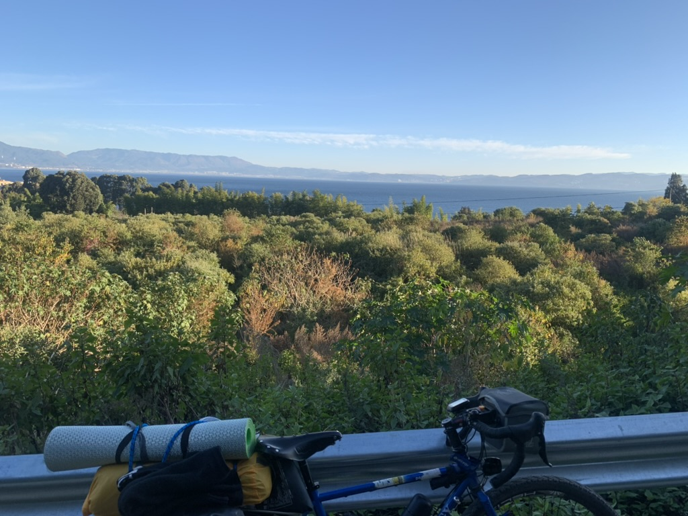

事实上，后来我才意识到，我所遭遇的最大的挑战恰恰不是补给匮乏，而是天气状况和疫情管控。

晚上，我在玉溪市市郊一处菜地过夜。露营地距离玉溪南部客运站仅几百米。

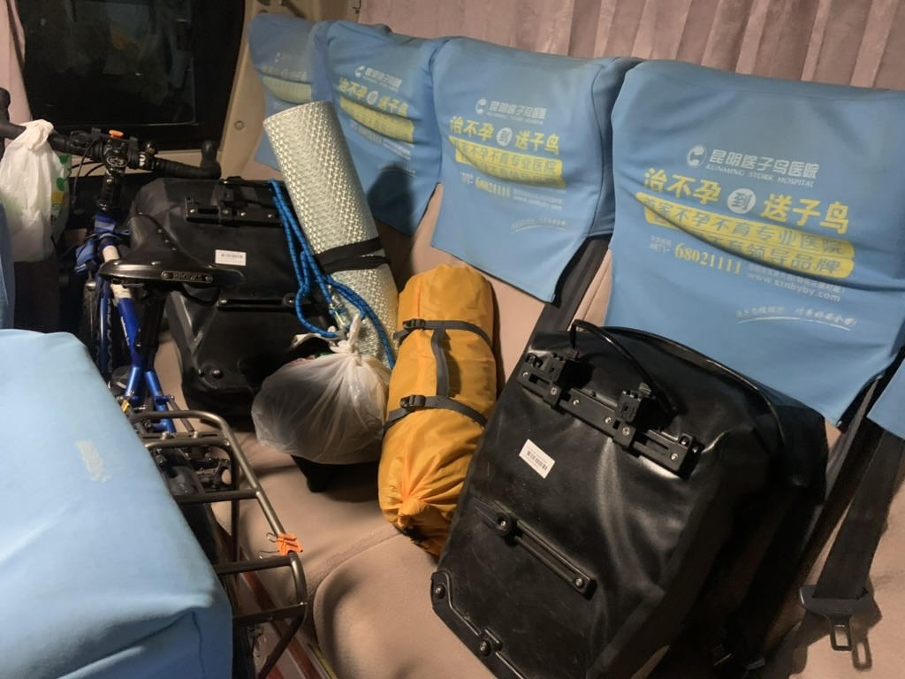

玉溪去文山的大巴车，我把自行车放在最后一排，这是司机建议的。

7日凌晨，还是满天繁星，我即起床赶大巴去往文山，再坐中巴从文山去麻栗坡县。麻栗坡县是云南东南边陲的边境县，直接与越南接壤。它是中越战争的前线战场，著名的老山会战在此发生。谢晋导演名作《高山下的花环》，花环指的就是位于麻栗坡县郊的烈士陵园，安葬着960名英勇奋战献出宝贵生命的烈士忠骨。

也正是在麻栗坡县和邻近的富宁县，大自然向云南人民慷慨展示了她在广西的拿手好戏——喀斯特地貌。从卫星图上看，一个个山包有如密密麻麻的豆粒粘在大地上一样。在我看来，每个“隆起”的山包都很突兀、陡峭，以至于这里的爬山真的变成了“爬”山。

下午，中巴车在入境麻栗坡的边境检查站被拦下。我被警官告知没有48小时内核酸报告不得进入边境县，只得下车折返到最近的镇子——新街镇。警官告诉我镇上可以做核酸检测。

常年居留上海的人几乎感觉不到疫情，现在来到边境地区直接被来了一个下马威。我立刻意识到，之后的行程不知道还要进入多少个沿边县。若是每个县都要求核酸报告，那得多么麻烦。对于机动能力受限的自行车旅行者，在这样的连绵山脉中骑车去核酸采样点得费多少心力啊。

事实上，不仅是在云南，后来在广西，我发现所有的沿边县都要求进入者必须持有48小时核酸报告，离开时也必须持有48小时报告。严格的疫情管控措施，逐渐成为我在此次行程中遇到的最大挑战——心理上的挑战。我甚至一度想要离开边境地区往内陆方向去，省去烦人的高频率核酸检测。要知道，219沿边公路沿途可没有县城，有的只是乡镇。而根据我的电话咨询，乡镇上的卫生院往往是上午采样，下午送到县城去检测。甚至某些乡镇的采样隔天才有。我必须在综合骑行里程、爬升、卫生院位置和采样时间、核酸报告48小时有效期的基础上，确定每一天的骑行计划。

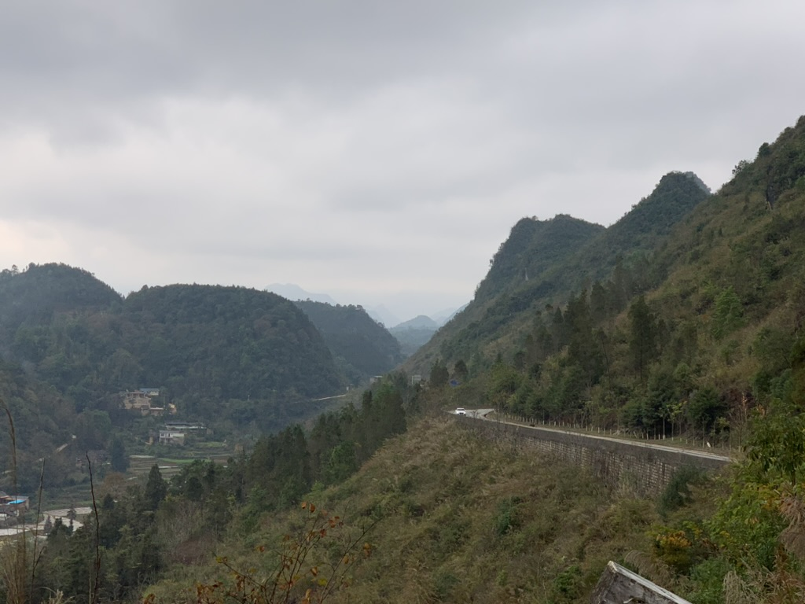

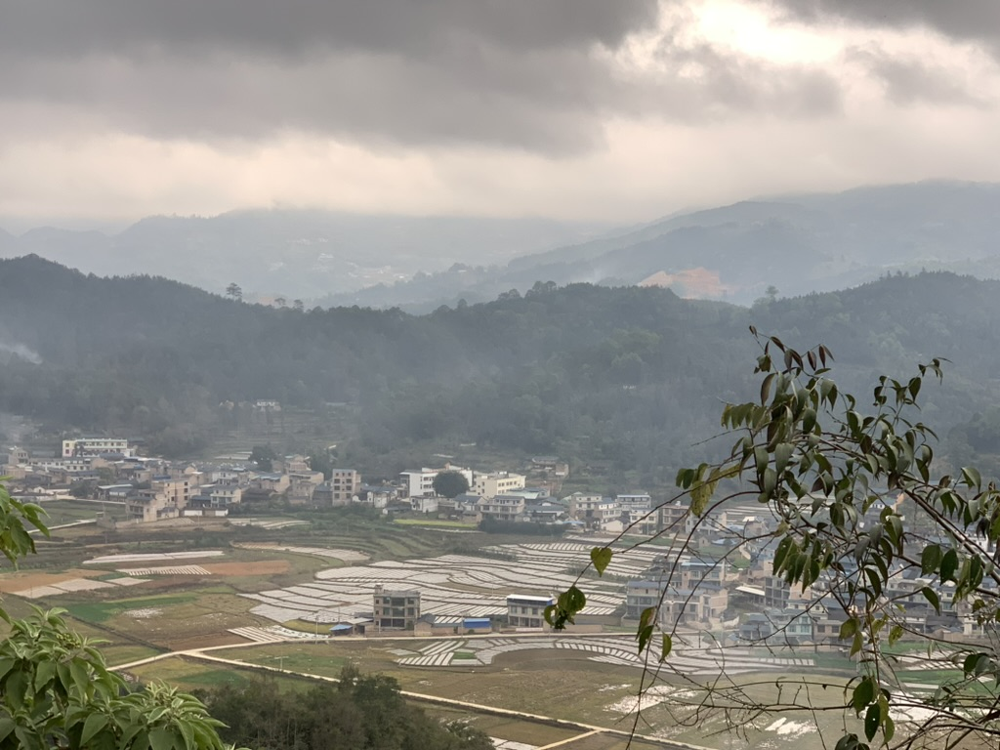

民居往往聚集在山间平地（坝子），而国道在山腰盘旋。

这是一种不同寻常的体验。在常规的骑行中，你只需要根据里程、爬升和落脚点安排每日行程。要是你携带了帐篷和炊具，那更是“走到哪算哪”就行。而现在，当我没有48小时内核酸报告这张通行证时，即便大清早就已经站在两县交界处，也不被检查站允许跨过去。

这里日出很晚，8日清晨天不亮，我便摸黑到医院，花一个小时做核酸检测。为了不耽误行程，我选择在这里直接踏上219国道，此后便一直沿着G219去往东兴。此行无法去成麻栗坡烈士陵园，算是一大遗憾。这一天，我又遇上了此行的另一个大挑战——天气状况。

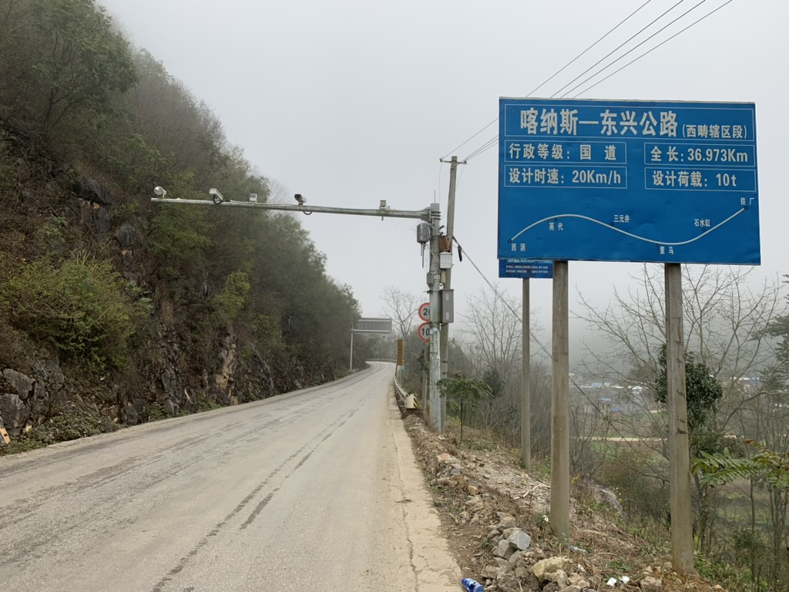

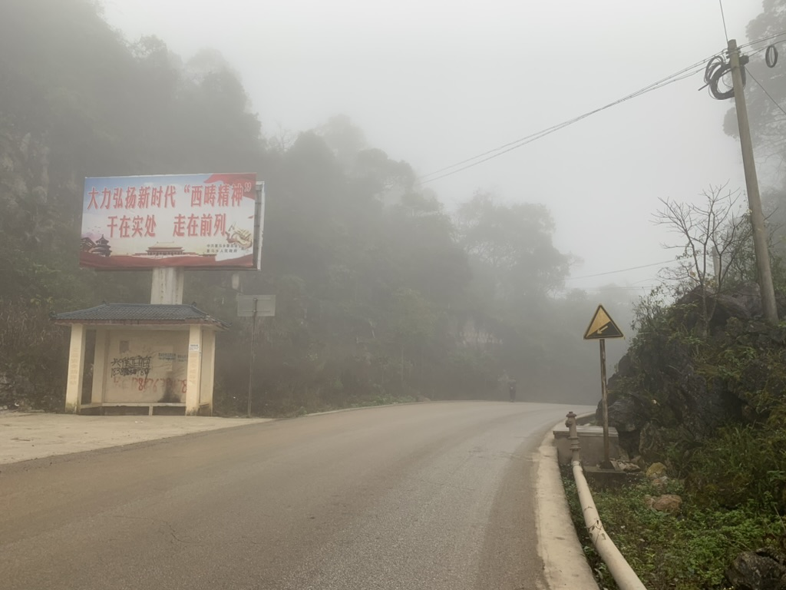

初次遇上山间大雾。晾在后座的衣服只会变的更湿。

这天中午1点左右，经过反复的爬升与下降，我的海拔来到1400米以上，置身于山雾之中。这是此次行程中第一次体验雾天。大雾天骑车有两大危险：能见度和湿冷。极低的能见度要求我必须打开前后车灯，密切关注前方浓雾中钻出来的车辆。而雾汽逐渐在眼镜上凝结，严重妨碍了我对交通情况的观察。我选择用手指擦掉镜片上的水珠。2021年我独自去安徽走盘山公路时遇上大雾，对向一辆轿车占用我侧车道朝我驶来，距离不到五米我才发现并迅速避开了。这让我至今还后怕。

第二个危险——湿冷，这对骑手提出了更大的考验。路上温度10度左右，而空气中弥漫着水汽。独特的喀斯特地貌导致这里的道路都是一上一下的起伏路。爬陡坡，踩起来就要出汗，得把雨衣脱下。下陡坡，为避免大风和水汽直接甩在身上，又得把雨衣穿上。脱衣穿衣，反反复复，令人心烦意乱。我的手套只保暖不防水，全身最冷的部位便是手指。2019年8月翻越积雪的天山山脉时，云层就像厚厚一层棉被一样盖在山脊上，我们从达坂出来一路下坡7km才离开云层。那时我的手指几乎冻僵，毫无知觉，幸好路边有一个烧烤摊可以烤火，这才缓过来。

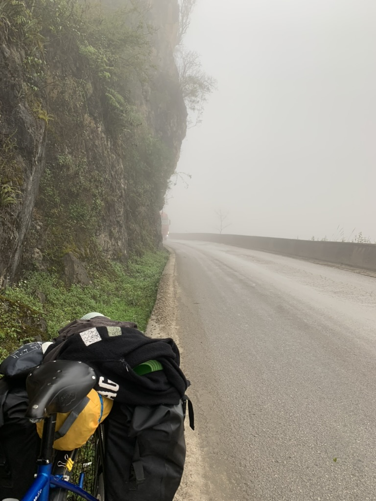

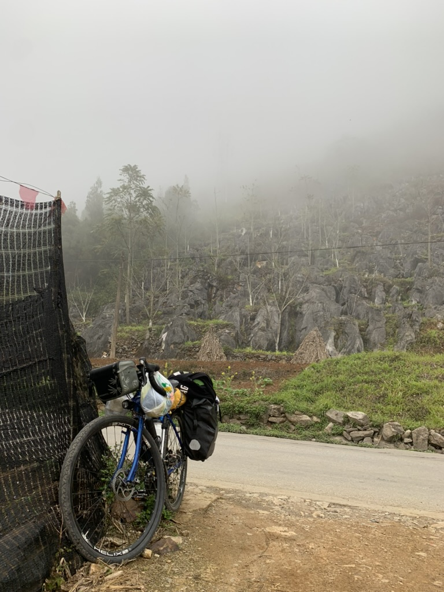

路面被雾水浸润，水珠夹杂着泥土，随着车轮往上飞舞，点缀着自行车和我的外表。在山路上穿行了几十公里后，我全身泥巴，车子则像刚从水田里爬出来的拖拉机。来到西畴县与麻栗坡县交界处，已经是下午四点多，我准备找地方搭帐篷。早晨的检测会在晚上出报告，第二天早晨便可进入麻栗坡县内。路边有一所小学，名七角巷小学，大门开着。学校操场是我心中理想的宿营地，于是我推车进入...