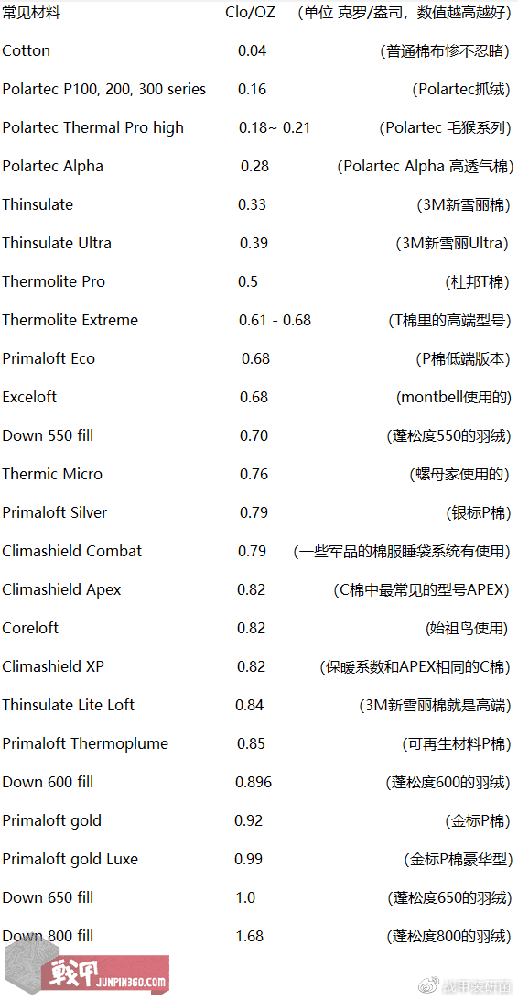

# 从“田野调研怎么穿”说起

我在多次调研中遇到过不太理想的天气，但无论酷暑寒冬，既然目的地已经确定，调研还是得进行。那么，如何减少天气对个人心情和调研活动的影响呢？我认为可以从衣着开始，逐步扩展到整套装备的选择。

首先，我们可以做一个判断：**田野调查/入村调研**与**徒步登山/背包旅行**在衣着等周边装备的选择上有很多相似之处。根据我的经验，田野调研可能会遇到高温、强风或雨雪天气，需走泥泞路段或爬山，甚至偶尔还得帮忙做些体力活。大家应该都有印象，那些在不同地方奔波进行新闻采访的记者，往往都会选择冲锋衣和徒步鞋。无论是田野调研，还是新闻采访，这些工作环境和徒步登山的条件非常相似。

因此，我们可以借鉴徒步装备搭配的基本思路，来确定田野调研时所需要的装备配置。徒步登山的常见装备系统至少包括：衣护系统、行进系统、睡眠系统、医卫系统、电力系统、露营系统、炊事系统和摄影系统。接下来，本文将按照这些系统展开详细说明。

# 一、衣护系统

徒步登山的衣护系统指的是衣着和防护系统。可以细分为上身、下身、头部、手部、脚部和护具。

## 1、上身

人的上身有非常多内脏器官，相比下身对温度变化是更加敏感的，因而也需要更周到的保护，要投入更多的人民币。

夏天时，有些朋友喜欢穿着颜色鲜艳、个性突出的各种T恤。但实际上，这样的选择可能会遇到两个问题：一是入村调研时应保持低调朴素，这样更容易拉近与当地人的心理距离；二是许多这样的T恤通常含有较高比例的棉花。夏季炎热，户外活动后容易出汗，而棉花虽然能吸汗，却不容易快速干燥，特别是早晚温差大的时候，容易引起感冒。我们有时闻到打篮球后的汗味，或是体型偏胖的人身上的气味，就是由于这一点。所以，如果预感自己会出汗，夏天最好避免选择纯棉材质的衣服。

市面上有不少速干面料的T恤都可以入手，价格都不贵。速干面料因各厂商的编织工艺不同，可能会有不同的技术名称（如杜邦的Coolmax、阿迪达斯的aeroready、montbell的wickron、始祖鸟的Phasic），但绝大多数是聚酯纤维（我戏称其为工业垃圾）。男士选购时注意不要选择太过轻薄的，容易露点，或者考虑胸贴。

夏天重点需要防晒，有的速干面料兼具防晒功能（如wickron），也可以额外准备一件防晒衣/皮肤衣/风壳（wind shell）。但其实，长袖速干衣即已经具备物理防晒功能，虽然防晒衣被营销得很厉害，但是有无必要是值得讨论的。

春秋冬的选择就复杂一些。按照三层穿衣法，可以分为内中外三层。**内层吸湿排汗（控温），中层保暖，外层防风防雨透气。**

首先是内层。**我们可以遵循夏季思路，选择速干面料的长袖打底，如power stretch / power dry/ power grid面料。也可以选择纯天然的羊毛打底，尤其是美利奴羊毛（抑菌防臭保温），但价格就上去了。**有些内层/打底层还可能加上薄绒，这其实就是吸收了抓绒（主要也是聚酯纤维）的功能，兼具一定的控温性能，在温度多变、频繁穿脱衣时有作用。冬季打底仍然不建议纯棉。

**其次是中层**，**有抓绒（fleece）、棉服（Synthetic Jackets）和羽绒（down jacket）三种选择**。中层主要起保温作用，而保温要依靠中间的空气层来锁定热量。在选购时，主要关注克罗值（CLO），这是目前国际上常用的保暖性指标之一。CLO的定義是指「在室溫21度、相對濕度50%、空氣流速不超過10cm/s的環境下，一個成人靜坐至感覺舒適，其所需衣服的保暖值為1 CLO。」克罗值越大，面料的保暖性能越高。

网上列出了很多数据对比，克罗值从小到大分别是：天然棉花0.04，美利奴羊毛0.084，Polartec绒 0.16-0.28，3M新雪丽棉（Thinsulate）0.33，杜邦T棉（Thermolite）0.5，exceloft棉0.68，P棉（Primaloft）黑标0.7，羽绒550蓬0.7，P棉银标0.79，C棉（可能是Coreloft，始祖鸟家）0.82，羽绒600蓬0.896，P棉金标0.92（有的说0.96），羽绒625蓬0.92，羽绒650蓬1.0，羽绒850蓬1.86。
（图片来自参考资料4。⬇️）

从数据可以看出，棉花的保暖性最差，抓绒（Polartec就是抓绒）其次，棉服和羽绒的保暖性要更好。其中，科技面料金标P棉的保暖性已经赶上基础的羽绒服。在科技面料方面，结论是：**金标P棉>C棉>银标P棉>黑标P棉>杜邦T棉**。如果还要更好的，市面上还有羽绒1000蓬的产品，保暖性能会更高，这是人类科技目前能够达到的最高级别。

其实，抓绒和棉服都是聚酯纤维材质，只是后者对纤维进行了蓬松处理，用编制工艺强化了保暖性能。而羽绒则是天然的御寒材质，蓬松度越高越保暖。北极熊毛皮的克罗值是5.0。

值得注意的是，羽绒虽然保暖性天花板更高，但是一旦被打湿保暖性就迅速下降。所以，在户外徒步行进时，一般选择棉服。等到了营地或处于静态时，羽绒服才穿上。

- *如何选购？？？**抓绒购买时要看面料的【克重】，指的是每平方米此种面料的重量。一般单位是g/每平方米，即g/m2，或者很多户外产品会缩写为gsm，即gram per square meter。欧美国家，往往使用oz（盎司）作为单位，1盎司约等于28.35g，100g约等于3.5盎司。整体上来说，200克重可以作为一个分界线，作为保暖和透气两个属性的平衡点：超过200克重的，保暖很好，但透气欠佳；而200以下的抓绒，则透气更好，适合运动量更大穿着，但就不要指望有太好的静态保暖效果。

棉服的参数一般包括材质类型（暗示克罗值）、填充密度（g/m2）或填充量（g）。克罗值越高，填充密度或填充量越大，保暖性能越好。上面说了克罗值，这里展开说填充密度。一般，40-70 g/m2的产品兼顾舒适和透气，可以作为冬天的动态保暖，或者春秋的主力/静态保暖。70-100 g/m2适合相对怕冷人群。100以上的，是重型棉服，田野用不到。

羽绒服的参数包括蓬松度（与克罗值正相关）、填充量（g）、羽绒类型、含绒量（绒在“羽+绒”中的占比）。同样的羽绒，蓬松度越高，填充量越大，含绒量越高，保暖性能越好。网上有人总结含绒量的标准，认为70%属于达标，90%和95%是优秀。而在羽绒之间，一般鹅绒优于鸭绒。

**最后是外层**。外层起防风防水与透气功能，可以分为硬壳（也就是国人常说的冲锋衣）和软壳（soft shell）。

硬壳方面，防风防水功能与透气的平衡至关重要。如果不需要透气，选择一次性雨衣就很好。但是如果还需要透气，就必须使用科技面料了。在这方面，户外圈最出名的是Gore-Tex面料，其产品线细分为2层、2.5层、3层，或者是 Gore-Tex、Gore-Tex Pro、Gore-Tex Paclite® Plus、Gore-Tex Paclite®、Gore-Tex® Active 等。购买时应按需求选择。除Gore-Tex外，凯乐石、北面和mont-bell等都有自研面料。对比面料的关键在于厂家提供的防水和透气指数，同时也要结合消费者使用体验。

我现在一年四季都会在包里常备一件硬壳。之前在河南调研时，每天都在下雨，但我选择只穿硬壳而不打伞，因为这样行动更灵活方便。

相较于硬壳，软壳只提供基础的防小雨和防泼水功能，但穿着感更加柔软舒适。许多软壳内里会加一层薄绒，这是常见的配置，适合在春秋冬季天气较为温和时作为外层使用。如果羽绒服的表层也有防泼水设计，那么就可以省去穿软壳的需求。

有的软壳会设计一个**胸前拉链口袋**，这在我的田野调研中很有帮助，因为我可以把录音笔很方便地存放在里面，使用时就夹在口袋上。

## 2、下身

下身的配置思路与上身类似，同样可以遵循三层穿衣法。

内层可以选择速干合成面料或美利奴羊毛，外层则不必使用硬壳裤，大多数情况下，一条软壳裤足以应对田野调研中的95%场景。

根据我的经验，在冬季，一条薄款速干打底裤加一条带绒的软壳裤就能应对北京及北京以南的平原、丘陵和低山地区的气候。

夏季时，准备一条速干裤即可，既轻便又实用。

## 3、头部

戴帽子在夏天主要是为了防晒，可以选择**渔夫帽**或鸭舌帽；而在冬天则是为了保暖，可以选择聚酯纤维或羊毛材质的帽子，既能确保保暖，又具备速干功能。

此外，护耳或头巾等配件也是不错的选择，可以根据需要自行搭配。

## 4、手部

手套主要有两大作用：一是在冬天提供保暖，二是在劳动时起到防护作用（如劳保手套）。

冰袖则是在夏天用来防晒的理想选择。

## 5、脚部

我们每天走几万步，一双合适的鞋子非常关键。在田野调研中，经常需要面对未知的路况，有时遇到下雨，鞋子湿了也会带来不少困扰。但田野调研不同于高山攀登或高海拔长线徒步，通常不需要重装徒步鞋。只需要一双基础的徒步鞋，具备一定的防水功能，但又不过于闷热，就足够了。如果需要，防水袜也是一个不错的选择。

如果田野工作中需要下地干活，还需自备一双雨靴。

夏天可以选择溯溪鞋或透气跑鞋，方便透气又适合潮湿环境。洗澡时，可以使用折叠拖鞋。

袜子方面，夏季推荐速干袜，如迪卡侬的跑步袜。冬季则可以选择速干保暖袜，如徒步袜或羊毛袜，确保温暖和舒适。

## 6、护具

此外，还可以根据个人需要选购一些装备，比如墨镜和护膝。这些物品没有太多特别的选购技巧，主要根据个人需求和舒适度来选择。

在冬季的北方地区，可能还需要雪套来应对积雪或冰冷的环境，保护鞋子和腿部免受寒冷和湿气的侵袭。

# 二、背负系统

田野调研意味着离开舒适的学习或工作环境，带上一周、一个月甚至几个月所需的生活物资前往一个村庄或其他调研地点。这种需求与背包环球旅行的需求其实非常相似。环球旅行者通常背着一个大背包，里面装有所有必需的物资，到达一个城市后，再换上小包进行城市游或周边探索。

无论是田野调研还是环球旅行，合理的物资准备和轻便的装备都至关重要，能够确保在陌生环境中高效、舒适地工作或旅行。

徒步双肩包（一般40-60升）+小包（10-20升） 是我心目中的理想配置。我目前使用的是格里高利b65和格里高利Nano 20。之所以不使用行李箱，是因为行李箱太过笨重，不能支持我灵活地切换地点。而徒步背包虽然看着很重，但出色的背负系统可以很好改善背负体验，将重量由肩部转移到腰臀部。

此外，还需要为两个包分别配置防水罩，以防不测。有朋友提醒，应注意选购底部带排水孔的防水罩，防止雨水蓄积。还需要使用一些带抽绳的收纳袋/压缩袋来收纳衣物，以保证衣物（尤其是羽绒和棉服）能够得到较大程度的压缩，方便背包装下其它东西。

在进行远距离移动时，我们将所有物资打包后装进大包，把常用的物资放进小包，方便随时取用。一旦抵达驻点，进行日常的周边活动时，只需要背上小包即可，避免了不必要的负担，既轻便又高效。这样既能确保所有必需品都带在身上，又能在驻点内外活动时更加灵活舒适。

至于相机内胆包，我目前只使用一个抽绳式的收纳袋。

# 三、医卫系统

我一般常备对乙酰氨基酚（一罐，用于退烧止痛）和蒙脱石散（止泻）。如果感冒了，会临时在药店购入一些止咳药和感冒药。

在保健药方面，可以准备维生素等常用补充剂。此外，每个人还需要根据自己的身体状况和病史来准备个人所需的药物。

牙具和毛巾是必备物品，其中建议使用速干毛巾，棉质毛巾虽然舒适，但不太容易打理。

如果驻留时间较长，还需要准备指甲钳、晾衣绳/杆等生活必需品。男士则需要准备剃须刀，以便日常修整。

# 四、睡眠系统

户外徒步登山的睡眠系统确实非常复杂，包括帐篷、地垫等一系列装备。但在田野调研时，我们通常会有固定的室内住所，且有床可睡。因此，可以借鉴户外睡眠系统的一些思路，在此基础上进行简化。

例如，很多人外出旅行时对酒店的卫生情况不太放心，会选择自己带一次性套装。在田野调研中，我们可以选择使用户外用的**隔脏睡袋**，它通常很薄且便于收纳，既能保持清洁，又不占用太多空间。

此外，如果住在村民家里，条件可能相对简朴，为了避免打扰他们，我们可以自备一个**充气枕头**，既方便携带，又能提高睡眠质量。

# 五、炊事系统

如果长期住在村民家里，可以自备餐具，包括碗、筷、勺和杯子，以便使用。户外常用的餐具如钛杯，轻巧且耐用，如果有条件的话，可以考虑使用。这样不仅更卫生，也能增加一些舒适感。

# 六、电力系统

包括充电宝、各种线材和充电器，这些都是必备物品。大家平常出门旅行时都会带齐这些，在田野调研时也是一样。确保设备有足够的电量，尤其是在偏远地区，充电宝可以提供很大的帮助。

# 七、摄影系统

包括相机、镜头、配件（如三脚架）和电池等等。这方面我仍然在摸索中。目前去田野会带一台相机、一个挂机变焦镜头、一个大光定，三块电池。

以上内容从七个方面讲解了如何为田野调研选择合适的装备以提供支持，未来我也会继续完善本文。总的来说，选对装备能帮助我们更快地进入田野状态，提升休息和工作的质量，同时避免各种不必要的烦恼。在我看来，实用性比外观更为重要，正如montbell的slogan所说：**Function is Beauty**。

---

参考资料：
1，[什么是服装界的科技与狠活？带你认识一下保暖性堪比羽绒的科技棉（T棉、P棉、C棉）\_户外棉服\_什么值得买](https://post.smzdm.com/p/apvwprw0/)
2，[户外系统知识-装备大全：七年总结及购买策略，识别韭菜地#户外知识图谱\_哔哩哔哩\_bilibili](https://www.bilibili.com/video/BV1m24y1T7iu)
3，[ONLINE SHOP | Montbell](https://en.montbell.jp/products/)
4，[弹棉花咯——浅谈户外棉服的选择（1）填充棉](https://weibo.com/ttarticle/p/show?id=2309404607804584624405)