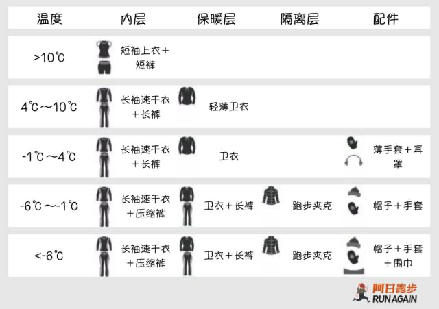

# 跑步如何穿衣

这个文档是我学习跑步穿衣的一些简单的笔记。

# 一、冬季

寒冷季节穿衣的原则：多层！

多层穿着的原因：

1，多层衣物搭配可以获得额外的隔离空气层，增加保温的效果。

2，运动的时候会产生热量。运动中，比运动前的静止状态需要的衣服少。但是，运动前和运动后就特别容易着凉。这就是多层的意义。冷了穿，热了脱。

⚠️ 去跑步时要带上外层保暖衣物。保证有衣物可以迅速保暖。或者可以迅速转移到温暖的环境。

## 三层穿衣原则

### 上装

1. 最内速干层
    
    尽量薄。速干（化纤面料），拒绝纯棉面料。合成面料可以迅速排走湿气，让水分蒸发，减少运动中的不适感和运动中失温的风险。一般来说，10度以上无风，短袖或长袖的速干衣跑步完全可以胜任，不需要考虑跑步的时候会冷。
    
2. 中间保暖层
    1. 运动型卫衣。与普通棉质卫衣不同，运动型卫衣多采用速干材质（复合型面料方便汗水的蒸发），没有帽子，袖子上给大拇指留个洞。
    2. 有时候卫衣外面再套一个棉服、棉马甲之类。
3. 最外隔离层
    
    防风防雨。跑步夹克。
    

### 下装

腿上都是肌肉，耐寒能力很强。稍厚一些的“压缩裤”，梭织、针织运动裤就可以满足需求。如果还怕冷，运动裤里面可以搭配个速干的打底裤。

### 其他

为了减少皮肤暴露在寒冷环境中的面积，可以配备【帽子】【手套】【脖套】【头巾】【头套】。幸福指数将翻倍。

如果不戴帽子，将有60-80%的能量通过头部流失。

# 二、夏季

几乎不是问题。注意补水防中暑即可。